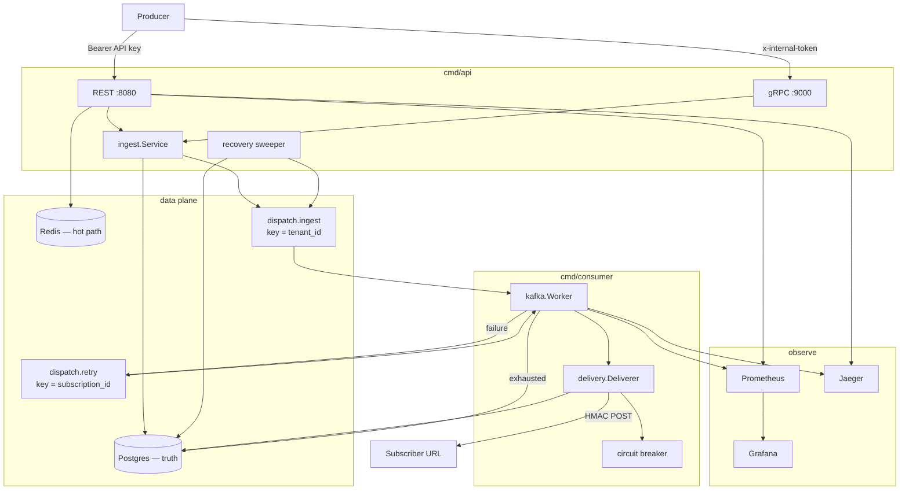
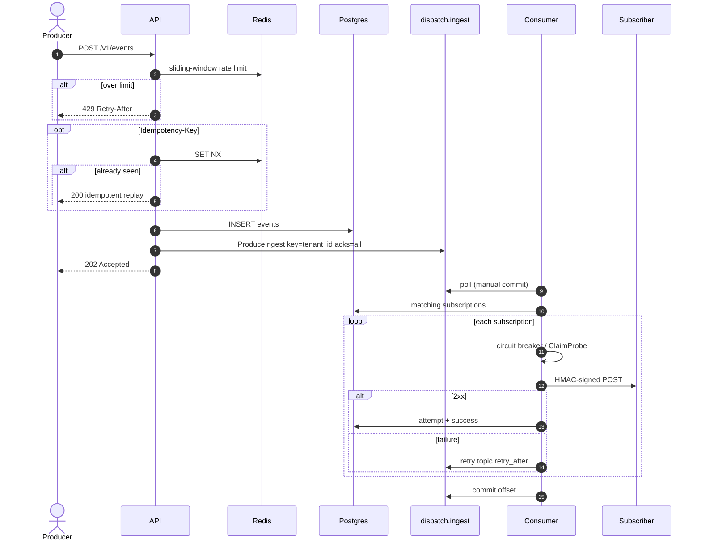
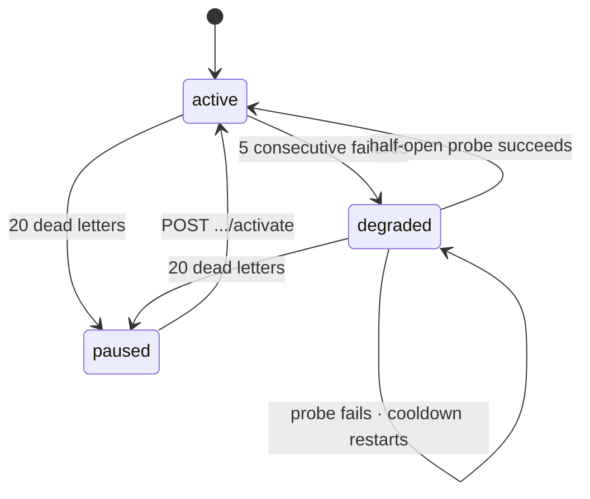

<div align="center">

```
 ____  _                 _       _
|  _ \(_)___ _ __   __ _| |_ ___| |__
| | | | / __| '_ \ / _` | __/ __| '_ \
| |_| | \__ \ |_) | (_| | || (__| | | |
|____/|_|___/ .__/ \__,_|\__\___|_| |_|
            |_|
```

# Dispatch

[](https://github.com/yxshwanth/Dispatch/actions/workflows/ci.yml)
[](https://go.dev)
[](https://www.postgresql.org)
[](https://redis.io)
[](https://redpanda.com)
[](LICENSE)

</div>

Webhook delivery looks like POST JSON to a URL.

At scale it is not. One dead subscriber stalls a tenant. A GET health-check returns 404 and tells you nothing. Producers need the event accepted in milliseconds. Subscribers need a signature they can verify. Failures need retries, then a queue you can query, then a replay that walks the same path.

This repo is that pipeline.

Two binaries. The API accepts. The consumer delivers.

| Binary | Package | Job |
| ------ | ------- | --- |
| API | [`cmd/api`](cmd/api/main.go) | REST + gRPC ingest, persist, produce, recovery sweep, DLQ replay |
| Consumer | [`cmd/consumer`](cmd/consumer/main.go) | Ingest + retry groups, HMAC delivery, circuit breaker, DLQ write |

Go. Postgres 16. Redis 7. Kafka (Redpanda locally, MSK in Terraform). franz-go. Prometheus. Grafana. OpenTelemetry to Jaeger.



---

## Run it

Docker, Go 1.22+, Make.

```bash
make up
```

That starts the data plane, api, consumer, echo webhook, Prometheus, Grafana, and Jaeger. Topics and migrations are included.

| | URL |
| --- | --- |
| API | http://localhost:8080 |
| gRPC ingest | `localhost:9000` (`x-internal-token`, default `dev-secret`) |
| Grafana | http://localhost:3000 · `admin` / `admin` |
| Prometheus | http://localhost:9092 |
| Jaeger | http://localhost:16686 |
| Echo webhook | http://localhost:8081 |

Host iterate against Compose: `make run-api` (`:8080` HTTP, `:9000` gRPC, `:9090` metrics) and `make run-consumer` (`:9091` metrics).

```bash
curl -sS -X POST http://localhost:8080/v1/tenants \
  -H 'Content-Type: application/json' \
  -d '{"name":"acme"}' | jq .

curl -sS -X POST http://localhost:8080/v1/subscriptions \
  -H "Authorization: Bearer $API_KEY" \
  -H 'Content-Type: application/json' \
  -d '{"url":"http://webhook:8080/","event_types":["order.created"]}' | jq .

curl -sS -X POST http://localhost:8080/v1/events \
  -H "Authorization: Bearer $API_KEY" \
  -H 'Content-Type: application/json' \
  -d '{"event_type":"order.created","payload":{"order_id":"ord_123"}}' | jq .
```

The tenant response returns `api_key` once. Use `http://webhook:8080/` when the consumer is in Compose.

Load: `make load` (default 50/s). Or `RATE=100/s DURATION=20s ./scripts/load/vegeta.sh`.

---

## How an event moves

Every accepted event gets a UUID at the API boundary.

That `event_id` is written to Postgres. It is stamped on the Kafka header, the consumer logs, the OTel span, and `X-Dispatch-Event-ID`.

Grep one id. You get the lifecycle.



Failed deliveries go to `dispatch.retry` with `retry_after`. The retry consumer sleeps until that timestamp. Lag on the retry topic is expected. Do not page on it.

```
attempt  1      2      3      4       5        6
         10s    30s    1m     5m      15m      DLQ
```

Backoff is `RETRY_BACKOFF`. Five slots. The sixth write is a dead letter.

Dead letters live in Postgres. Replay needs filter, pagination, and `replayed_at`. A Kafka topic cannot do that. `POST /v1/dead-letters/{id}/replay` marks the row and re-produces to ingest. Already replayed returns `409`. The event walks the same pipeline again.

The API sweeper runs every 30s. It re-produces events older than 60s with zero `delivery_attempts`. That covers INSERT succeeded, Kafka produce did not. Once any attempt exists, the retry path owns the rest.

Auto-commit is off. Crash mid-message, Kafka redelivers. Receivers must be idempotent. The signature and `event_id` are how they do it.

Ingest is partitioned by `tenant_id`. Retry is keyed by `subscription_id`. A failed delivery does not block later events for that tenant. The cost is: per-subscription order is best-effort under failure.

---

## Circuit breaker

Subscriptions are not pinged.

Most webhook receivers only accept signed POSTs. A GET health-check 404s and teaches you nothing. Half-open uses the next real event.

Concurrent waiters do not stampede. `store.ClaimProbe` is a conditional `UPDATE`. One probe flies.



| State | Delivery |
| ----- | -------- |
| active | Allowed |
| degraded | Held for cooldown (default 60s), then one claimed probe |
| paused | Held until `POST .../activate` |

Every transition writes `subscription_state_transitions`. Conditional `UPDATE ... WHERE state = …` so one winner records the audit row.

---

## Signature

The MAC covers time and body. Not the body alone.

```
string_to_sign  =  "{unix_seconds}.{raw_json_bytes}"
signature       =  hex( HMAC-SHA256(secret, string_to_sign) )
```

| Header | Meaning |
| ------ | ------- |
| `X-Dispatch-Signature` | Hex HMAC |
| `X-Dispatch-Timestamp` | Unix seconds used in the MAC |
| `X-Dispatch-Event-ID` | Correlation id |

Receivers should reject timestamps older than 5 minutes, or more than 5 minutes in the future. `hmacsign.VerifyFresh` implements that window. Dispatch does not enforce it on the send path. The receiver does.

`POST /v1/subscriptions/{id}/rotate-secret` keeps the previous secret valid for a grace window (default 24h). Dispatch always signs with the current secret.

The API key is returned once at tenant create. Only `SHA-256(api_key)` is stored.

---

## What each store owns

Do not mix the jobs.

| | Postgres | Redis | Kafka |
| --- | --- | --- | --- |
| Owns | Tenants, subs, secrets, events, attempts, DLQ, CB audit | Rate limit, idempotency | Fan-out buffer, retry delay |
| If it dies | The system is down | Rate limit fails open. Idempotency falls to a partial unique index | Client gets `500`. Sweeper re-produces |
| Why here | Replay needs SQL | Hot and forgettable | Ordering and backoff. Not a query API |

```
ratelimit:{tenant_id}                 ZSET    sliding window (UnixNano scores)
idempotency:{tenant_id}:{key}         STRING  SET NX + TTL (24h)
events (tenant_id, idempotency_key)   unique  WHERE key IS NOT NULL
dead_letters                          unique  pending (event_id, subscription_id)
```

---

## Result

Measured 2026-07-16 on Docker Compose. `RATE=50/s`, `DURATION=15s`, vegeta against the in-compose webhook. Laptop figures. Not a cloud SLO.

Ingest latency is not delivery latency.

**Ingest** — `POST /v1/events` → `202`. 50.1 events/sec. 750 requests. 100% accepted.

| | |
| ---: | --- |
| p50 | 1.30 ms |
| p95 | 1.75 ms |
| p99 | 2.09 ms |
| max | 17.1 ms |

**Delivery** — consumer → subscriber. `dispatch_delivery_duration_seconds{status="success"}`. n = 750. Mean 1.62 ms.

| | |
| ---: | --- |
| p50 | ~1.7 ms |
| p95 | ~2.4 ms |
| p99 | ~2.5 ms |

99.7% of successes ≤ 2.5 ms. All ≤ 5 ms. Consumer lag 0 after settle.

Completeness: no events older than 30s missing attempts for matching subscriptions. [`scripts/load/completeness.sql`](scripts/load/completeness.sql).

An earlier 100/s run accepted 100% at ingest p99 ~2 ms. Re-measure delivery if you need matching histogram n.

Grafana: http://localhost:3000/d/dispatch-delivery/dispatch-delivery

---

## HTTP API

Auth: `Authorization: Bearer <api_key>`. Tenant create and health are open. Errors: `{"error":"…"}`. Pagination: `cursor` (RFC3339Nano) + `limit` (default 20, max 100).

| | Path | |
| --- | --- | --- |
| `POST` | `/v1/tenants` | Returns plaintext `api_key` once |
| `POST` | `/v1/subscriptions` | Returns HMAC `secret` once |
| `GET` | `/v1/subscriptions` | Cursor list |
| `GET` | `/v1/subscriptions/{id}` | Tenant-scoped |
| `DELETE` | `/v1/subscriptions/{id}` | |
| `POST` | `/v1/subscriptions/{id}/rotate-secret` | Dual-secret grace (`grace_period`, default 24h) |
| `POST` | `/v1/subscriptions/{id}/activate` | Un-pause the circuit |
| `GET` | `/v1/subscriptions/{id}/deliveries` | Attempt log |
| `POST` | `/v1/events` | `202` accepted. `200` idempotent replay. `413` / `415` / `429` |
| `GET` | `/v1/dead-letters?subscription_id=` | Pending DLQ |
| `POST` | `/v1/dead-letters/{id}/replay` | Re-produce to ingest. `409` if already replayed |
| `GET` | `/healthz` `/readyz` | Liveness / Postgres ping |

Envelope: `{ "event_type": "…", "payload": { } }`. Body ≤ 256 KiB. `Content-Type` must be `application/json` when set. Optional header: `Idempotency-Key`.

Full contract: [`docs/architecture.md`](docs/architecture.md).

REST and gRPC share `internal/ingest.Service`. Unary `dispatch.v1.IngestionService/IngestEvent` on `:9000`. Auth is metadata `x-internal-token`. That token is static. Production internal gRPC would use mTLS.

```bash
grpcurl -plaintext -H "x-internal-token: dev-secret" \
  -d '{"tenant_id":"…","event_type":"order.created","payload":"eyJ4IjoxfQ=="}' \
  localhost:9000 dispatch.v1.IngestionService/IngestEvent
```

`payload` is base64 in grpcurl JSON because the field is `bytes`.

---

## Trade-offs

| Decision | Choice | Cost |
| -------- | ------ | ---- |
| Ordering under failure | Do not block the stream | Per-subscription order is best-effort after a miss |
| Half-open | Real signed event + `ClaimProbe` | No synthetic health signal. Probe waits for a real event |
| DLQ | Postgres | Not a Kafka topic. Replay is SQL |
| Retries | One topic + `retry_after` | Retry lag is expected. No delay-topic tiers |
| REST + gRPC | Shared `ingest.Service` | Two adapters. One ingest path |
| Ingest metrics | No `tenant_id` label | You cannot break down ingest by tenant in Prometheus |
| Redis down (rate limit) | Fail open | Protection, not a correctness gate |
| Kafka acks | All ISR | Produce after persist. Sweeper covers the gap |
| Offset commit | After process | At-least-once. Duplicate deliveries are possible |
| Auth | API keys | No OAuth, SSO, or RBAC |

franz-go is the client because of consumer groups, revoke hooks, and future MSK IAM.

---

## What I would do differently

gRPC ingest authenticates with a static token. Wire mTLS.

Terraform for MSK IAM is ready. The Go client does not use the IAM signer yet. Local runs plaintext Redpanda.

A single retry topic is enough at this scale. At larger delay spreads, tiered delay topics win.

These numbers are Compose on a laptop. Do not treat them as a cloud SLO.

---

## Failure modes

| Failure | Behavior |
| ------- | -------- |
| Redis down (rate limit) | Fail open. Ingest continues |
| Redis down (idempotency) | Fall through. Postgres unique index |
| Kafka produce fail after INSERT | Client `500`. Sweeper re-produces |
| Subscriber 5xx / timeout | Attempt row + CB. Retry topic |
| Subscriber gone forever | Backoff exhausts → DLQ → maybe `paused` |
| Consumer crash mid-message | Offset uncommitted. Redelivery |
| Degraded subscription | New events skipped until the claimed probe |
| Paused subscription | Skipped until `POST .../activate` |
| Replay twice | `409 Conflict` |

---

## Observability

`event_id` is an attribute on every span. Trace context rides Kafka headers (W3C). `/healthz`, `/readyz`, and `/metrics` are not traced.

| Signal | |
| ------ | --- |
| `dispatch_events_ingested_total` | API. No tenant label |
| `dispatch_delivery_duration_seconds` | Histogram. Labeled `status` |
| `dispatch_delivery_total` | `success` / `failure` / `timeout` / `skipped` |
| `dispatch_circuit_breaker_state` | Gauge by `state` |
| `dispatch_dead_letters_total` | Counter |
| `dispatch_consumer_lag` | Ingest group vs high watermark |
| `dispatch_retry_queue_depth` | Approximate pending retries |

API metrics `:9090`. Consumer `:9091`.

---

## Deploy

| Path | |
| ---- | --- |
| [`docker-compose.yml`](docker-compose.yml) | Local data plane + api + consumer + obs |
| [`deploy/helm/dispatch/`](deploy/helm/dispatch/) | Separate api / consumer Deployments. Probes. `preStop` drain. IRSA-ready ServiceAccounts |
| [`terraform/`](terraform/) | VPC, EKS, Aurora, MSK, ElastiCache, S3 archival (Glacier @ 90d) |
| [`.github/workflows/ci.yml`](.github/workflows/ci.yml) | Compose, migrate, topics, `go test ./... -race` |

Helm `preStop` sleeps 5–10s so the load balancer drains before SIGTERM. Set `terminationGracePeriodSeconds` ≥ preStop + 15s app shutdown.

`terraform validate` is the gate. Live AWS apply is optional.

---

## Layout

```
cmd/api                    REST, gRPC, sweeper, shutdown
cmd/consumer               ingest + retry worker
internal/
  httpapi/                 mux, auth, handlers
  grpcapi/                 IngestEvent adapter
  ingest/                  shared persist + produce
  kafka/                   codecs, producer, worker, lag, W3C carrier
  delivery/                outbound POST + HMAC headers
  circuitbreaker/          pure state machine
  hmacsign/                Sign / Verify / VerifyFresh / rotation
  store/                   Postgres, ClaimProbe, DLQ
  ratelimit/               Redis ZSET window
  idempotency/             Redis SET NX
  recovery/                orphan re-produce
  metrics/  tracing/  auth/  config/
migrations/                schema
deploy/helm/               K8s packaging
deploy/observability/      Prometheus + Grafana-as-code
terraform/                 AWS footprint
proto/dispatch/v1/         ingest.proto
```

[`docs/architecture.md`](docs/architecture.md) is the deep dive. [`docs/summary.md`](docs/summary.md) is the snapshot. [`docs/project_overview.md`](docs/project_overview.md) is the rationale.

[MIT](LICENSE)
