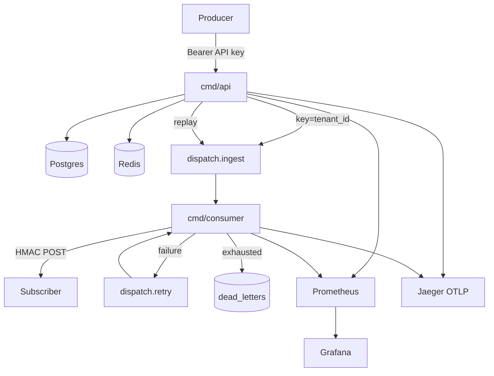

# Dispatch


A multi-tenant webhook delivery platform — the kind of internal system Stripe,
GitHub, and Twilio build or buy. Producers POST events; Dispatch fans them out
to subscriber endpoints with HMAC signing, retries, circuit breaking, dead-letter
replay, and a full local observability stack.



**Stack:** Go · Postgres 16 · Redis 7 · Kafka (Redpanda / MSK) · franz-go · Prometheus · Grafana · OpenTelemetry / Jaeger · optional gRPC ingest

---

## Benchmarks (Compose)

Measured **2026-07-16** on local Docker Compose (`RATE=50/s DURATION=15s`
`./scripts/load/vegeta.sh` → in-compose `webhook`). Laptop figures, not cloud SLOs.
**Ingest latency ≠ delivery latency.**

**Ingest** (vegeta → `POST /v1/events` → `202`):

| | |
|--|--|
| Throughput | **50.1 events/sec** for ~15s (**750** requests), **100%** `202` |
| HTTP latency | p50 **1.30 ms** · p95 **1.75 ms** · p99 **2.09 ms** · max **17.1 ms** |

**Delivery** (consumer → subscriber HTTP), from
`dispatch_delivery_duration_seconds{status="success"}` on this same run
(fine buckets 1 ms … 10 s; n=750; mean from `_sum/_count`):

| | |
|--|--|
| Mean | **1.62 ms** |
| p50 / p95 / p99 | **~1.7 ms** / **~2.4 ms** / **~2.5 ms** (from cumulative buckets) |
| Mass | **99.7%** of successes ≤ **2.5 ms**; all ≤ **5 ms** |
| Consumer lag | **0** after settle |

Completeness SQL: no events older than 30s missing attempts for this run’s
matching subscriptions (`scripts/load/completeness.sql`).

Grafana: http://localhost:3000/d/dispatch-delivery/dispatch-delivery

Harder ingest smoke (optional): `RATE=100/s DURATION=20s ./scripts/load/vegeta.sh`
(earlier run hit 100/s with 100% `202` and ingest p99 ~2 ms; re-measure delivery
after that load if you want matching histogram n).

---

## Quick start

Requires Docker, Go 1.22+, Make.

```bash
make up                 # data plane + api + consumer + webhook + Prometheus/Grafana/Jaeger
                        # migrations + Kafka topics included

# optional host iterate against Compose infra:
make run-api            # :8080 HTTP, :9000 gRPC, :9090 metrics
make run-consumer       # :9091 metrics
```

| Service | URL |
| ------- | --- |
| API | http://localhost:8080 |
| gRPC ingest | localhost:9000 (`GRPC_INTERNAL_TOKEN`, default `dev-secret`) |
| Grafana | http://localhost:3000 (admin/admin; anonymous viewer on) |
| Prometheus | http://localhost:9092 |
| Jaeger | http://localhost:16686 |

```bash
# 1) tenant (api_key returned once)
curl -sS -X POST http://localhost:8080/v1/tenants \
  -H 'Content-Type: application/json' -d '{"name":"acme"}' | jq .

# 2) subscription (use http://webhook:8080/ when consumer is in Compose)
curl -sS -X POST http://localhost:8080/v1/subscriptions \
  -H "Authorization: Bearer $API_KEY" -H 'Content-Type: application/json' \
  -d '{"url":"http://webhook:8080/","event_types":["order.created"]}' | jq .

# 3) event → 202 Accepted
curl -sS -X POST http://localhost:8080/v1/events \
  -H "Authorization: Bearer $API_KEY" -H 'Content-Type: application/json' \
  -d '{"event_type":"order.created","payload":{"order_id":"ord_123"}}' | jq .
```

Load test: `make load` (default 50/s) or `RATE=100/s DURATION=20s ./scripts/load/vegeta.sh`.

---

## HTTP API (essentials)

Auth: `Authorization: Bearer <api_key>` (except tenant create and health).

| Method | Path | Notes |
| ------ | ---- | ----- |
| `POST` | `/v1/tenants` | Returns plaintext `api_key` once |
| `POST` | `/v1/subscriptions` | Returns HMAC `secret` once |
| `POST` | `/v1/events` | `202` accepted; `200` idempotent replay; `413` / `415` |
| `GET` | `/v1/subscriptions/{id}/deliveries` | Attempt log |
| `GET` | `/v1/dead-letters?subscription_id=` | Pending DLQ |
| `POST` | `/v1/dead-letters/{id}/replay` | Re-produce to ingest |
| `GET` | `/healthz`, `/readyz` | Liveness / readiness |

Full table: [`docs/architecture.md`](docs/architecture.md).

**Internal gRPC** (same ingest path as REST): `dispatch.v1.IngestionService/IngestEvent`
on `:9000`, auth via metadata `x-internal-token` (static token — deliberate
simplification; production internal gRPC would use mTLS/SPIFFE).

```bash
# payload is base64 for bytes fields in grpcurl JSON
grpcurl -plaintext -H "x-internal-token: dev-secret" \
  -d '{"tenant_id":"…","event_type":"order.created","payload":"eyJ4IjoxfQ=="}' \
  localhost:9000 dispatch.v1.IngestionService/IngestEvent
```

---

## Design decisions

| Decision | Choice | Why |
| -------- | ------ | --- |
| Ordering under failure | Don’t block the stream | One dead URL must not stall a tenant (Stripe/GitHub tradeoff) |
| Half-open CB | Real signed event + **`ClaimProbe` single-flight** | Synthetic GETs are useless; concurrent probes would stampede — we fixed that race with a conditional `UPDATE` before the POST |
| DLQ | Postgres | Replay needs filter, pagination, `replayed_at` |
| Retries | One retry topic + `retry_after` | Avoids delay-topic tiers at this scale |
| REST + gRPC | Shared `internal/ingest.Service` | One ingestion path, two thin adapters |
| Metrics labels | No high-cardinality `tenant_id` on ingest | Protect Prometheus |

---

## What it doesn’t handle

| Non-goal | Rationale |
| -------- | --------- |
| OAuth / complex auth | API keys only — by design |
| Tiered retry topics | Single retry topic + `retry_after` is enough |
| Active endpoint health pings | Half-open uses real signed events only |
| DLQ as a Kafka topic | Replay UX needs Postgres |
| Strict per-subscription ordering under failure | Failed events don’t block later ones |
| Perfect cloud absolute latency numbers | Measure on Compose; discuss bottlenecks |

---

## Docs

| Doc | Contents |
| --- | -------- |
| [`docs/summary.md`](docs/summary.md) | Full project snapshot |
| [`docs/architecture.md`](docs/architecture.md) | Pipelines, packages, CB/DLQ/HMAC |
| [`docs/project_overview.md`](docs/project_overview.md) | Design rationale |
| [`docs/roadmap.md`](docs/roadmap.md) | Gates and calendar |
| [`docs/task_list.md`](docs/task_list.md) | Atomic checkboxes |

## License

[MIT](LICENSE)
