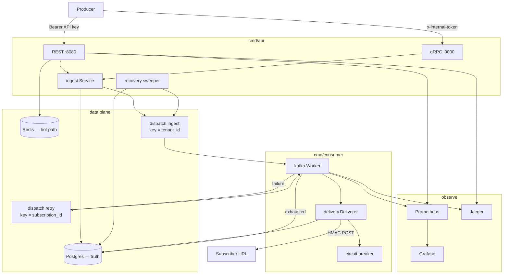
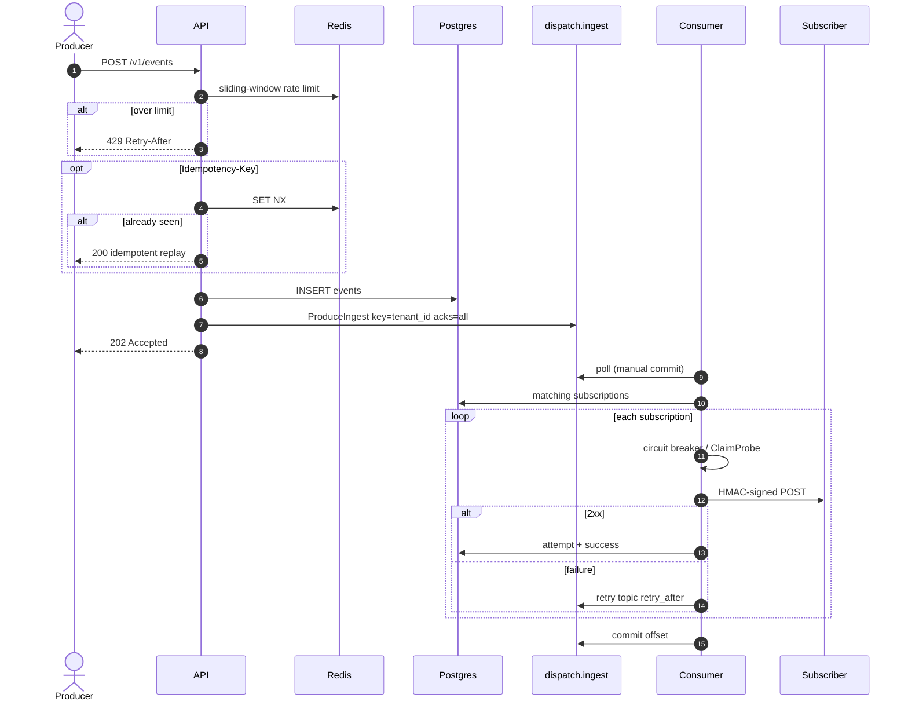
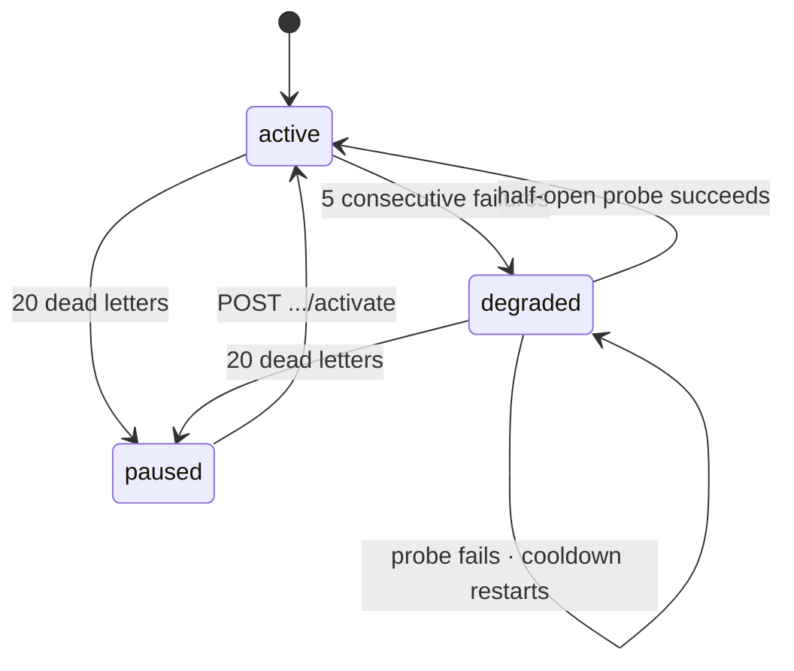

<div align="center">

```
 ____  _                 _       _
|  _ \(_)___ _ __   __ _| |_ ___| |__
| | | | / __| '_ \ / _` | __/ __| '_ \
| |_| | \__ \ |_) | (_| | || (__| | | |
|____/|_|___/ .__/ \__,_|\__\___|_| |_|
            |_|
```

# Dispatch

**The webhook control plane.**  
Producers fire events. Subscribers get signed POSTs. One dead URL never stalls a tenant.

<br/>

[](https://github.com/yxshwanth/Dispatch/actions/workflows/ci.yml)
[](https://go.dev)
[](https://www.postgresql.org)
[](https://redis.io)
[](https://redpanda.com)
[](LICENSE)

`ingest → persist → partition → sign → deliver → retry → dead-letter → replay`

<br/>

| accept | sign | protect | recover | see |
|:------:|:----:|:-------:|:-------:|:---:|
| **202** in ~1 ms | HMAC-SHA256 | half-open CB | Postgres DLQ | metrics · traces · lag |

</div>

---

Stripe, GitHub, and Twilio all run a system like this. Dispatch is that system, end to end: multi-tenant ingest, Kafka fan-out, HMAC-signed delivery, retries with backoff, a circuit breaker that uses **real events** (not fake pings), a queryable dead-letter queue, and a local observability stack you can actually open.

Two binaries. One pipeline. Grep one `event_id` and you see the whole life of an event.

```
  producer                         dispatch                              subscriber
     │                                │                                      │
     │  POST /v1/events               │                                      │
     │  Authorization: Bearer …       │                                      │
     │───────────────────────────────►│                                      │
     │                                │  persist · produce · 202             │
     │◄───────────────────────────────│                                      │
     │                                │                                      │
     │                                │  HMAC POST                           │
     │                                │  X-Dispatch-Signature                │
     │                                │  X-Dispatch-Timestamp                │
     │                                │  X-Dispatch-Event-ID                 │
     │                                │─────────────────────────────────────►│
     │                                │                                      │
     │                                │            2xx  →  done              │
     │                                │            5xx  →  retry topic       │
     │                                │            exhausted → DLQ           │
```

---

## Why it exists

Webhook delivery looks like “POST JSON to a URL.” At scale it is a reliability product.

| What producers want | What subscribers need | What operators cannot allow |
| ------------------- | --------------------- | --------------------------- |
| Accept the event **now** (`202`) | A **signed** body they can trust | One dead endpoint stalling a tenant |
| Idempotent retries of their own POSTs | Replay protection (timestamp in the MAC) | A synthetic health-check that 404s and lies |
| A key they can rotate | Dual-secret grace while they deploy | Prometheus labels that explode cardinality |

Dispatch is opinionated about those tradeoffs. The opinions are in [Design decisions](#design-decisions). The code is in `internal/`.

---

## The stack

<div align="center">

**Go** · **Postgres 16** · **Redis 7** · **Kafka** (Redpanda locally, MSK in Terraform) · **franz-go** · **Prometheus** · **Grafana** · **OpenTelemetry / Jaeger** · optional **gRPC ingest**

</div>

| Binary | Package | Job |
| ------ | ------- | --- |
| **API** | [`cmd/api`](cmd/api/main.go) | REST + gRPC ingest, auth, persist, produce, recovery sweep, DLQ replay |
| **Consumer** | [`cmd/consumer`](cmd/consumer/main.go) | Ingest + retry groups, HMAC delivery, circuit breaker, DLQ write |



---

## Life of an event

Every accepted event is a UUID born at the API boundary. That `event_id` is written to Postgres, stamped on the Kafka header, logged on every consumer line, attached to the OTel span, and POSTed as `X-Dispatch-Event-ID`. One grep. Full story.



<details>
<summary><strong>Backoff, DLQ, and the sweeper</strong> — what happens after the first miss</summary>

<br/>

**Retry schedule** (env `RETRY_BACKOFF`, five slots):

```
  attempt  1        2        3        4         5         6
           │        │        │        │         │         │
           ▼        ▼        ▼        ▼         ▼         ▼
         10s      30s       1m       5m       15m       DLQ
```

The retry consumer **sleeps until `retry_after`**. Lag on `dispatch.retry` is expected — do not page on it.

**Dead letters live in Postgres**, not a Kafka topic. Replay needs filter, pagination, and `replayed_at`. `POST /v1/dead-letters/{id}/replay` marks the row (409 if already replayed) and **re-produces to ingest** — the event walks the same pipeline again.

**Recovery sweeper** (API process, every 30s): events older than 60s with **zero** `delivery_attempts` get produced again. Covers “INSERT succeeded, Kafka produce did not.” Once any attempt exists, the retry path owns the rest.

**At-least-once.** Auto-commit is off. Crash mid-message → redelivery. Receivers must be idempotent; the signature plus `event_id` is how they do it.

**Ordering.** Ingest partition key = `tenant_id` (per-tenant order on a partition). Retry key = `subscription_id` (isolates a sick endpoint). A failed delivery **does not** block later events for that tenant. Same tradeoff Stripe and GitHub make.

</details>

---

## Circuit breaker

Subscriptions are not pinged. Most webhook receivers only accept **signed POSTs**; a GET health-check returns 404 and teaches you nothing. Half-open uses the **next real event**. Concurrent waiters do not stampede: `store.ClaimProbe` is a conditional `UPDATE` so **one** probe flies.



| State | What delivery does |
| ----- | ------------------ |
| **active** | Always allowed |
| **degraded** | Held for cooldown (default 60s), then **one** claimed probe |
| **paused** | Held until an operator hits activate |

Every transition writes `subscription_state_transitions` (`from_state`, `to_state`, `reason`). Conditional `UPDATE ... WHERE state = …` so only one winner records the audit row.

---

## The signature

Receivers should treat unsigned traffic as hostile. Dispatch signs the way Stripe and GitHub do: the MAC covers **time and body**, not the body alone.

```
  string_to_sign  =  "{unix_seconds}.{raw_json_bytes}"
  signature       =  hex( HMAC-SHA256(secret, string_to_sign) )
```

| Header | Meaning |
| ------ | ------- |
| `X-Dispatch-Signature` | Hex HMAC |
| `X-Dispatch-Timestamp` | Unix seconds used in the MAC |
| `X-Dispatch-Event-ID` | Correlation id |

**Reject timestamps older than 5 minutes** (and more than 5 minutes in the future). Helper: `hmacsign.VerifyFresh` / `DefaultReplayWindow`. Enforced on the **receiver**, not inside the deliverer.

Secret rotation (`POST /v1/subscriptions/{id}/rotate-secret`) keeps the previous secret valid for a grace window (default 24h). Dispatch always **sends** with the current secret; `VerifyWithRotation` is for receivers and tests.

The API key is returned **once** at tenant create. Only `SHA-256(api_key)` is stored.

---

## Who owns what

Three stores, three jobs. Mixing them is how webhook platforms get weird.

| | **Postgres** | **Redis** | **Kafka** |
| --- | --- | --- | --- |
| **Owns** | Tenants, subs, secrets, events, attempts, DLQ, CB audit | Rate limit, idempotency | Fan-out buffer, retry delay |
| **If it dies** | The system is down | Rate limit **fails open**; idempotency falls through to a partial unique index | Produce-after-INSERT → client 500; sweeper heals |
| **Why not the others** | Replay needs SQL | Must be hot and forgettable | Ordering + backoff, not a query API |

```
  ratelimit:{tenant_id}                 ZSET   sliding window (UnixNano scores)
  idempotency:{tenant_id}:{key}         STRING SET NX + TTL (24h)
  events (tenant_id, idempotency_key)   unique WHERE key IS NOT NULL
  dead_letters                          unique pending (event_id, subscription_id)
```

---

## Benchmarks

Measured **2026-07-16** on Docker Compose (`RATE=50/s`, `DURATION=15s`, vegeta → in-compose `webhook`). Laptop figures, not cloud SLOs.

**Ingest latency is not delivery latency.**

<div align="center">

### Ingest — `POST /v1/events` → `202`

**50.1 events/sec** · **750** requests · **100%** accepted

| | | |
| ---: | :--- | :--- |
| p50 | `████░░░░░░░░░░░░░░░░` | **1.30 ms** |
| p95 | `██████░░░░░░░░░░░░░░` | **1.75 ms** |
| p99 | `███████░░░░░░░░░░░░░` | **2.09 ms** |
| max | `████████████████████` | **17.1 ms** |

### Delivery — consumer → subscriber

`dispatch_delivery_duration_seconds{status="success"}` · n = 750 · mean **1.62 ms**

| | | |
| ---: | :--- | :--- |
| p50 | `█████░░░░░░░░░░░░░░░` | **~1.7 ms** |
| p95 | `████████░░░░░░░░░░░░` | **~2.4 ms** |
| p99 | `████████░░░░░░░░░░░░` | **~2.5 ms** |

**99.7%** of successes ≤ **2.5 ms** · all ≤ **5 ms** · consumer lag **0** after settle

</div>

Completeness: no events older than 30s missing attempts for matching subscriptions ([`scripts/load/completeness.sql`](scripts/load/completeness.sql)).

Harder smoke: `RATE=100/s DURATION=20s ./scripts/load/vegeta.sh` (earlier run: 100/s, 100% `202`, ingest p99 ~2 ms).

Grafana: [Dispatch Delivery](http://localhost:3000/d/dispatch-delivery/dispatch-delivery)

---

## Quick start

Docker, Go 1.22+, Make.

```bash
make up          # data plane + api + consumer + webhook + Prometheus / Grafana / Jaeger
                 # topics + migrations included
```

| | URL |
| --- | --- |
| API | http://localhost:8080 |
| gRPC ingest | `localhost:9000` (`x-internal-token`, default `dev-secret`) |
| Grafana | http://localhost:3000 · `admin` / `admin` · anonymous viewer on |
| Prometheus | http://localhost:9092 |
| Jaeger | http://localhost:16686 |
| Echo webhook | http://localhost:8081 |

Host iterate against Compose infra: `make run-api` (`:8080` HTTP, `:9000` gRPC, `:9090` metrics) and `make run-consumer` (`:9091` metrics).

```bash
# 1 — tenant (api_key is shown once)
curl -sS -X POST http://localhost:8080/v1/tenants \
  -H 'Content-Type: application/json' \
  -d '{"name":"acme"}' | jq .

# 2 — subscription  (use http://webhook:8080/ when the consumer is in Compose)
curl -sS -X POST http://localhost:8080/v1/subscriptions \
  -H "Authorization: Bearer $API_KEY" \
  -H 'Content-Type: application/json' \
  -d '{"url":"http://webhook:8080/","event_types":["order.created"]}' | jq .

# 3 — event → 202 Accepted
curl -sS -X POST http://localhost:8080/v1/events \
  -H "Authorization: Bearer $API_KEY" \
  -H 'Content-Type: application/json' \
  -d '{"event_type":"order.created","payload":{"order_id":"ord_123"}}' | jq .
```

Load: `make load` (default 50/s) or `RATE=100/s DURATION=20s ./scripts/load/vegeta.sh`.

---

## HTTP API

Auth: `Authorization: Bearer <api_key>` except tenant create and health. Errors: `{"error":"…"}`. Pagination: `cursor` (RFC3339Nano) + `limit` (default 20, max 100).

| | Path | |
| --- | --- | --- |
| `POST` | `/v1/tenants` | Returns plaintext `api_key` **once** |
| `POST` | `/v1/subscriptions` | Returns HMAC `secret` **once** |
| `GET` | `/v1/subscriptions` | Cursor list |
| `GET` | `/v1/subscriptions/{id}` | Tenant-scoped |
| `DELETE` | `/v1/subscriptions/{id}` | |
| `POST` | `/v1/subscriptions/{id}/rotate-secret` | Dual-secret grace (`grace_period`, default 24h) |
| `POST` | `/v1/subscriptions/{id}/activate` | Un-pause the circuit |
| `GET` | `/v1/subscriptions/{id}/deliveries` | Attempt log |
| `POST` | `/v1/events` | `202` accepted · `200` idempotent replay · `413` / `415` / `429` |
| `GET` | `/v1/dead-letters?subscription_id=` | Pending DLQ |
| `POST` | `/v1/dead-letters/{id}/replay` | Re-produce to ingest · `409` if already replayed |
| `GET` | `/healthz` `/readyz` | Liveness / Postgres ping |

`POST /v1/events` envelope: `{ "event_type": "…", "payload": { } }`. Body ≤ 256 KiB. `Content-Type` must be `application/json` when set.

Optional header: `Idempotency-Key`.

Full contract: [`docs/architecture.md`](docs/architecture.md).

<details>
<summary><strong>Internal gRPC</strong> — same ingest path, thinner adapter</summary>

<br/>

REST and gRPC share `internal/ingest.Service`. Unary `dispatch.v1.IngestionService/IngestEvent` on `:9000`. Auth is metadata `x-internal-token` (static token — a deliberate simplification; production internal gRPC would use mTLS / SPIFFE).

```bash
grpcurl -plaintext -H "x-internal-token: dev-secret" \
  -d '{"tenant_id":"…","event_type":"order.created","payload":"eyJ4IjoxfQ=="}' \
  localhost:9000 dispatch.v1.IngestionService/IngestEvent
```

`payload` is base64 in grpcurl JSON because the field is `bytes`.

</details>

---

## Design decisions

| | Choice | Why |
| --- | --- | --- |
| **Ordering under failure** | Do not block the stream | One dead URL must not stall a tenant |
| **Half-open** | Real signed event + `ClaimProbe` single-flight | Synthetic GETs are noise; concurrent probes would stampede |
| **DLQ** | Postgres | Replay needs filter, pagination, `replayed_at` |
| **Retries** | One topic + `retry_after` | Delay-topic tiers do not pay off at this scale |
| **REST + gRPC** | Shared `ingest.Service` | One ingestion path, two thin adapters |
| **Metrics labels** | No `tenant_id` on ingest | Protect Prometheus |
| **Rate limit down** | Fail **open** | Protection mechanism, not a correctness gate |
| **Kafka acks** | `all` ISR | Produce after persist; sweeper covers the gap |
| **Commit** | After process, never before | At-least-once without silent loss |
| **Client** | franz-go | Groups, revoke hooks, future MSK IAM |

---

## What it will not do

These are non-goals, not missing tickets.

| Non-goal | Rationale |
| -------- | --------- |
| OAuth / SSO / RBAC | API keys only — spend the complexity on delivery |
| Tiered retry topics | One retry topic + timestamp is enough |
| Active endpoint pings | Half-open is a real signed event |
| DLQ as a Kafka topic | Replay UX is SQL |
| Strict per-subscription order after a failure | Failed events do not block later ones |
| Perfect cloud latency as a trophy | Measure Compose; discuss bottlenecks |
| High-cardinality metric labels | `event_id` and raw URLs stay out of Prometheus |

---

## Observability

`event_id` is an attribute on every span. Trace context rides Kafka headers (W3C). Health and metrics endpoints are not traced.

| Signal | Where |
| ------ | ----- |
| `dispatch_events_ingested_total` | API — no tenant label |
| `dispatch_delivery_duration_seconds` | Histogram, labeled `status` |
| `dispatch_delivery_total` | `success` / `failure` / `timeout` / `skipped` |
| `dispatch_circuit_breaker_state` | Gauge by `state` |
| `dispatch_dead_letters_total` | Counter |
| `dispatch_consumer_lag` | Ingest group vs high watermark |
| `dispatch_retry_queue_depth` | Approximate pending retries |

API metrics `:9090` · consumer `:9091` · Prometheus scrapes both in Compose.

---

## Deploy shape

| Path | What it is |
| ---- | ---------- |
| [`docker-compose.yml`](docker-compose.yml) | Local data plane + api + consumer + obs |
| [`deploy/helm/dispatch/`](deploy/helm/dispatch/) | Separate api / consumer Deployments, probes, `preStop` drain, IRSA-ready ServiceAccounts |
| [`terraform/`](terraform/) | VPC, EKS, Aurora, MSK, ElastiCache, S3 archival (Glacier @ 90d) |
| [`.github/workflows/ci.yml`](.github/workflows/ci.yml) | Compose, migrate, topics, `go test ./... -race` |

Helm: `preStop` sleep 5–10s so the load balancer drains **before** SIGTERM. `terminationGracePeriodSeconds` ≥ preStop + 15s app shutdown. Live AWS apply is optional; `terraform validate` is the gate.

---

## Failure modes

| Failure | Behavior |
| ------- | -------- |
| Redis down (rate limit) | Fail open; ingest continues |
| Redis down (idempotency) | Fall through; Postgres unique index |
| Kafka produce fail after INSERT | Client `500`; sweeper re-produces |
| Subscriber 5xx / timeout | Attempt row + CB; retry topic |
| Subscriber gone forever | Backoff exhausts → DLQ → maybe `paused` |
| Consumer crash mid-message | Offset uncommitted → redelivery |
| Degraded subscription | New events skipped until the claimed probe |
| Paused subscription | Skipped until `POST .../activate` |
| Replay twice | `409 Conflict` |

---

## Layout

```
cmd/api                    REST, gRPC, sweeper, shutdown
cmd/consumer               ingest + retry worker
internal/
  httpapi/                 mux, auth, handlers
  grpcapi/                 IngestEvent adapter
  ingest/                  shared persist + produce
  kafka/                   codecs, producer, worker, lag, W3C carrier
  delivery/                outbound POST + HMAC headers
  circuitbreaker/          pure state machine
  hmacsign/                Sign / Verify / VerifyFresh / rotation
  store/                   Postgres, ClaimProbe, DLQ
  ratelimit/               Redis ZSET window
  idempotency/             Redis SET NX
  recovery/                orphan re-produce
  metrics/  tracing/  auth/  config/
migrations/                schema
deploy/helm/               K8s packaging
deploy/observability/      Prometheus + Grafana-as-code
terraform/                 AWS footprint
proto/dispatch/v1/         ingest.proto
```

---

## Docs

| | |
| --- | --- |
| [`docs/summary.md`](docs/summary.md) | Full project snapshot |
| [`docs/architecture.md`](docs/architecture.md) | Pipelines, packages, CB / DLQ / HMAC |
| [`docs/project_overview.md`](docs/project_overview.md) | Design rationale and watch-outs |
| [`docs/roadmap.md`](docs/roadmap.md) | Gates and calendar |
| [`docs/task_list.md`](docs/task_list.md) | Atomic checkboxes |

---

<div align="center">

**MIT** © 2026 Yash · [LICENSE](LICENSE)

*Accept fast. Deliver signed. Never let one bad URL stop the rest.*

</div>
