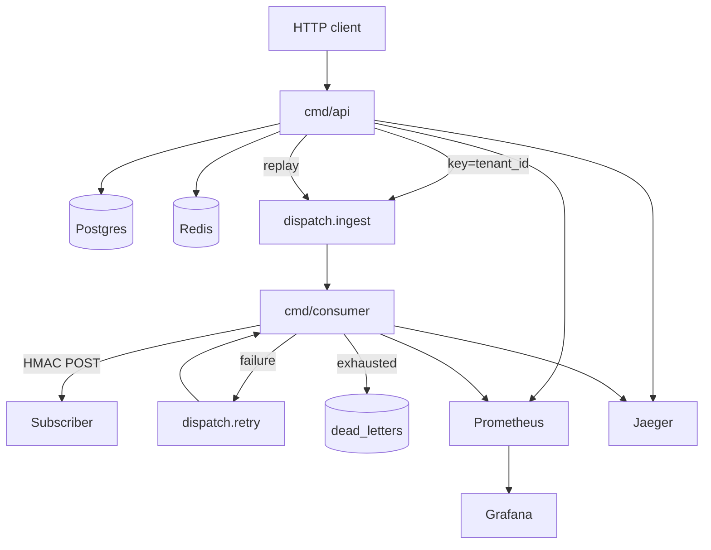

# Dispatch

Multi-tenant webhook delivery platform. Producers ingest events over HTTP;
Dispatch fans them out to subscriber endpoints with HMAC signing, retries,
circuit breaking, dead-letter replay, and full local observability.

```text
Producer ──POST /v1/events──► API ──produce──► Kafka (ingest)
                               │                    │
                               ▼                    ▼
                          Postgres              Consumer
                          Redis                   │
                                                  ├── HMAC POST ──► Subscriber
                                                  ├── fail ──► Kafka (retry)
                                                  └── exhausted ──► dead_letters

api:9090 / consumer:9090 ──► Prometheus ──► Grafana
API + consumer spans ──────► Jaeger (OTLP)
```

**Stack:** Go · Postgres 16 · Redis 7 · Kafka (Redpanda locally / MSK in Terraform) · franz-go · Prometheus · Grafana · OpenTelemetry / Jaeger

---

## Features

- **Multi-tenant ingest** — API-key auth; events filtered to matching subscriptions by `event_type`
- **Reliable delivery** — exponential backoff (`10s → 30s → 1m → 5m → 15m`), then Postgres DLQ with replay
- **HMAC-SHA256 signing** — Stripe/GitHub-style `timestamp.payload` signatures; secret rotation with a grace window
- **Circuit breaker** — `active → degraded → paused`; half-open probe with real events after cooldown (no synthetic health pings)
- **Rate limiting & idempotency** — Redis sliding window per tenant; optional `Idempotency-Key`
- **Ordering** — Kafka partition key = `tenant_id` (per-tenant order). Failed deliveries do **not** block later events for the same subscription
- **Observability** — Prometheus metrics on `:9090`, provisioned Grafana dashboard, OTel traces across ingest → Kafka → delivery (Jaeger)

---

## Quick start

Requires Docker, Go 1.22+, and Make.

```bash
make up              # Postgres, Redis, Redpanda, api, consumer, webhook, Prometheus, Grafana, Jaeger
                     # runs migrations + creates Kafka topics

# Optional host iterate (infra still from Compose):
make run-api         # :8080 / metrics :9090
make run-consumer    # metrics :9091
```

| Service | URL |
| ------- | --- |
| API | http://localhost:8080 |
| Grafana | http://localhost:3000 (admin/admin; anonymous viewer on) |
| Prometheus | http://localhost:9092 |
| Jaeger UI | http://localhost:16686 |
| Webhook echo | http://localhost:8081 |

### Walkthrough

**1. Create a tenant** (API key returned once):

```bash
curl -sS -X POST http://localhost:8080/v1/tenants \
  -H 'Content-Type: application/json' \
  -d '{"name":"acme"}' | jq .
# → { "id": "...", "api_key": "..." }
```

**2. Create a subscription** (HMAC secret returned once):

```bash
export API_KEY=...   # from step 1

curl -sS -X POST http://localhost:8080/v1/subscriptions \
  -H "Authorization: Bearer $API_KEY" \
  -H 'Content-Type: application/json' \
  -d '{
    "url": "http://webhook:8080/",
    "event_types": ["order.created"]
  }' | jq .
```

Use `http://webhook:8080/` when the consumer runs in Compose (service DNS). From a host-run consumer, point at `http://localhost:8081/`.

**3. Ingest an event** (`202 Accepted` after Kafka produce):

```bash
curl -sS -X POST http://localhost:8080/v1/events \
  -H "Authorization: Bearer $API_KEY" \
  -H 'Content-Type: application/json' \
  -H 'Idempotency-Key: demo-1' \
  -d '{
    "event_type": "order.created",
    "payload": {"order_id": "ord_123", "total": 4200}
  }' | jq .
```

**4. Inspect deliveries / DLQ / traces:**

```bash
curl -sS "http://localhost:8080/v1/subscriptions/$SUB_ID/deliveries" \
  -H "Authorization: Bearer $API_KEY" | jq .

curl -sS "http://localhost:8080/v1/dead-letters?subscription_id=$SUB_ID" \
  -H "Authorization: Bearer $API_KEY" | jq .
```

Open Jaeger and search by tag `event_id`. Grafana dashboard **Dispatch Delivery** is provisioned under folder Dispatch.

Subscriber endpoints receive:

| Header | Purpose |
| ------ | ------- |
| `X-Dispatch-Signature` | Hex HMAC-SHA256 over `{unix}.{raw_body}` |
| `X-Dispatch-Timestamp` | Unix seconds used in the signature |
| `X-Dispatch-Event-ID` | Correlation ID |

**Replay window:** receivers should reject signatures whose timestamp is older than **5 minutes** (or more than 5 minutes in the future). Helper: `hmacsign.VerifyFresh` / `DefaultReplayWindow`. This is documented as a consumer-side check; Dispatch signs with the current time at delivery.

---

## Benchmarks (Compose)

Measured on the local Docker Compose stack (`make up` + `make load` / `scripts/load/vegeta.sh`), targeting the in-compose `webhook` echo receiver. Numbers are laptop/Compose figures, not cloud SLOs.

| Metric | Result |
| ------ | ------ |
| Ingest rate | **100 events/sec** sustained for 20s (2000 requests) |
| Ingest success | **100%** `202 Accepted` |
| Ingest HTTP latency | p50 **1.2 ms**, p95 **1.6 ms**, p99 **~2.0 ms** (vegeta) |
| Delivery duration (Prometheus histogram) | p50 **~5 ms**, p95/p99 **~10 ms** bucket (mean **~1.6 ms** from `_sum/_count`) |
| Consumer lag | stayed **~0** under this load (ingest partitions = 3) |
| Completeness | successful attempts tracked events with matching subscriptions; no pending DLQ after settle |

Re-run:

```bash
make load
# or: RATE=100/s DURATION=20s ./scripts/load/vegeta.sh
```

Completeness SQL: `scripts/load/completeness.sql`.

---

## Architecture

Two binaries share domain packages:

| Binary | Role |
| ------ | ---- |
| `cmd/api` | REST surface, persist events, produce to Kafka, DLQ replay, recovery sweep, metrics + traces |
| `cmd/consumer` | Ingest + retry consumer groups, HMAC delivery, enqueue retries / DLQ, lag gauges |



Deep dive: [`docs/architecture.md`](docs/architecture.md).

---

## Design decisions

| Decision | Choice | Why |
| -------- | ------ | --- |
| Ordering under failure | Best-effort; failed deliveries don’t block the stream | One dead endpoint must not stall a tenant’s entire event flow |
| Circuit breaker | Half-open probe with the next real signed event | Synthetic GETs 404 on most webhook receivers; fake POSTs are rude |
| DLQ | Postgres table + partial index on `replayed_at IS NULL` | Replay needs filter, pagination, and mark-as-replayed — not a Kafka topic |
| Retry scheduling | Single retry topic; consumer sleeps until `retry_after` | Avoids tiered delay topics; acceptable with one retry partition |
| Auth | SHA-256 hashed API keys | Enough for multi-tenant isolation; not an auth product demo |
| Kafka client | `twmb/franz-go` | Clean consumer groups + MSK IAM path later |
| Metrics cardinality | No `tenant_id` on ingest counter; CB gauge by `state` counts | Avoids Prometheus label explosion |
| Tracing | W3C `traceparent` on Kafka headers | Kafka has no native W3C propagation |

---

## HTTP API

Auth: `Authorization: Bearer <api_key>` (except tenant create and health).

| Method | Path | Notes |
| ------ | ---- | ----- |
| `POST` | `/v1/tenants` | Returns plaintext `api_key` once |
| `POST` | `/v1/subscriptions` | Returns HMAC `secret` once |
| `GET` | `/v1/subscriptions` | Cursor pagination |
| `GET` | `/v1/subscriptions/{id}` | |
| `DELETE` | `/v1/subscriptions/{id}` | |
| `POST` | `/v1/subscriptions/{id}/rotate-secret` | Dual-secret grace window |
| `POST` | `/v1/subscriptions/{id}/activate` | Un-pause circuit breaker |
| `GET` | `/v1/subscriptions/{id}/deliveries` | Attempt log |
| `POST` | `/v1/events` | `202` accepted; `200` idempotent replay; `413` oversized; `415` bad Content-Type |
| `GET` | `/v1/dead-letters?subscription_id=` | Pending only |
| `POST` | `/v1/dead-letters/{id}/replay` | `202` / `409` if already replayed |
| `GET` | `/healthz`, `/readyz` | Liveness / Postgres readiness |

Full route table and pipelines: [`docs/architecture.md`](docs/architecture.md) §4–5.

---

## Configuration

Loaded from the environment (defaults in `internal/config`):

| Variable | Default | Purpose |
| -------- | ------- | ------- |
| `DATABASE_URL` | local Postgres | Primary store |
| `REDIS_ADDR` | `localhost:6379` | Rate limit + idempotency |
| `KAFKA_BROKERS` | `localhost:19092` | Redpanda external listener |
| `API_ADDR` | `:8080` | HTTP listen |
| `METRICS_ADDR` | `:9090` | Prometheus scrape |
| `OTEL_EXPORTER_OTLP_ENDPOINT` | `localhost:4318` | Jaeger OTLP HTTP |
| `OTEL_TRACING_ENABLED` | `true` | Toggle tracing |
| `MAX_PAYLOAD_BYTES` | `262144` | Request body cap (`413`) |
| `DELIVERY_TIMEOUT` | `10s` | Outbound HTTP timeout |
| `RATE_LIMIT_PER_MINUTE` | `60` | Per-tenant sliding window (Compose api uses a high value for demos) |
| `CB_FAILURE_THRESHOLD` | `5` | Failures before `degraded` |
| `CB_COOLDOWN` | `60s` | Half-open probe wait |
| `CB_DLQ_PAUSE_THRESHOLD` | `20` | DLQ count before `paused` |
| `RETRY_BACKOFF` | `10s,30s,1m,5m,15m` | Retry schedule |
| `CONSUMER_MODE` | `all` | `all` \| `ingest` \| `retry` |

---

## Development

```bash
make test                 # unit tests (testify), including HMAC freshness + 413/415
make test-integration     # needs Compose up; DISPATCH_INTEGRATION=1
make load                 # vegeta ingest + completeness SQL
make down                 # tear down Compose
```

CI (`.github/workflows/ci.yml`) brings up Compose, migrates, creates topics, and runs `go test ./... -race`.

---

## Deploy

| Path | Location |
| ---- | -------- |
| Terraform (VPC, EKS + IRSA, Aurora, MSK, ElastiCache, S3) | [`terraform/`](terraform/) |
| Helm chart (api + consumer, probes, preStop, Ingress, scrape annotations) | [`deploy/helm/dispatch/`](deploy/helm/dispatch/) |
| Observability provisioning | [`deploy/observability/`](deploy/observability/) |

Pods expose `prometheus.io/scrape` annotations on port `9090`. Set `METRICS_ADDR` / `OTEL_*` via Helm `config` values.

Local demos do not require a live AWS apply; Terraform is validated and Helm is deploy-shaped.

---

## Non-goals

- OAuth / complex identity — API keys only
- Tiered Kafka delay topics — one retry topic + `retry_after`
- Active endpoint health pings — half-open uses real signed events
- Strict per-subscription ordering when a delivery fails
- Perfect cloud latency numbers as a success metric — measure on Compose and discuss bottlenecks

---

## Status

Phases **0–4** complete. Milestone gates **M0–M4** closed. See [`docs/halfway_summary.md`](docs/halfway_summary.md) and [`docs/roadmap.md`](docs/roadmap.md).

---

## Docs

| Doc | Contents |
| --- | -------- |
| [`docs/architecture.md`](docs/architecture.md) | Package map, pipelines, CB, DLQ, stores |
| [`docs/project_overview.md`](docs/project_overview.md) | Design rationale and phased build plan |
| [`docs/roadmap.md`](docs/roadmap.md) | Gates and calendar |
| [`docs/task_list.md`](docs/task_list.md) | Atomic checkboxes |
| [`docs/halfway_summary.md`](docs/halfway_summary.md) | What’s shipped vs remaining |

## License

[MIT](LICENSE)
