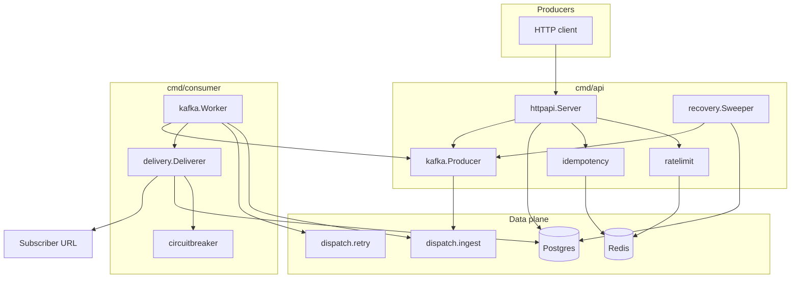
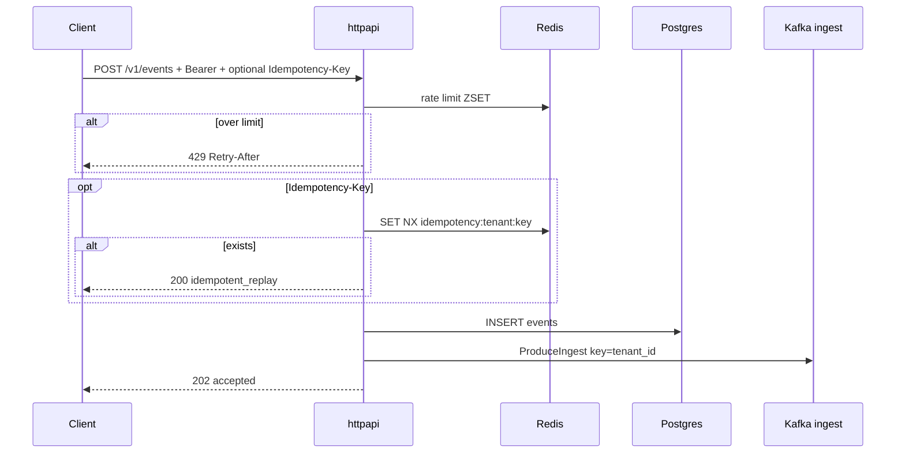
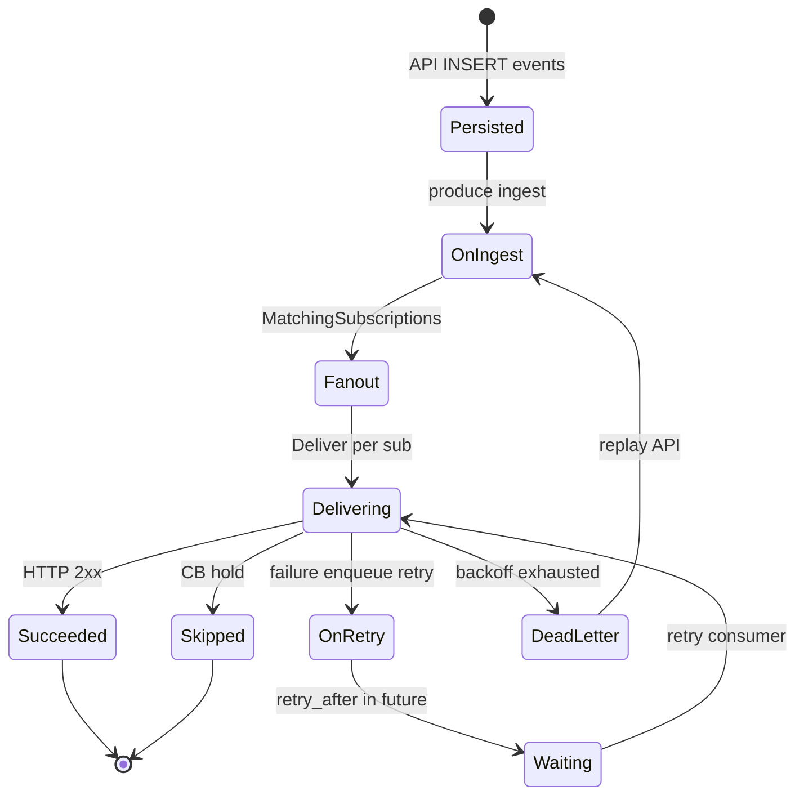

# Dispatch — Architecture (deep dive)

Granular description of how the running application is structured and how
data moves through it. Design *why* lives in [project_overview.md](project_overview.md);
status in [summary.md](summary.md); build order in
[roadmap.md](roadmap.md).

**Module:** `github.com/yash/dispatch`  
**Stack:** Go · Postgres 16 · Redis 7 · Kafka (Redpanda locally / MSK in Terraform) · franz-go

---

## 1. System at a glance

Two long-running binaries share domain packages:

| Binary | Package | Job |
| ------ | ------- | --- |
| API | [`cmd/api`](../cmd/api/main.go) | Auth’d REST, persist events, produce to Kafka, recovery sweep, DLQ replay |
| Consumer | [`cmd/consumer`](../cmd/consumer/main.go) | Ingest + retry consumer groups, HMAC delivery, enqueue retries / DLQ |



---

## 2. Package map

```
cmd/
  api/main.go              # wire deps, HTTP server, sweeper, graceful shutdown
  consumer/main.go         # wire deps, kafka.Worker.Run
internal/
  config/                  # env → Config
  auth/                    # API key hash, secret generation
  httpapi/                 # mux, middleware, handlers
  store/                   # all Postgres access (concrete, no Repository iface)
  kafka/
    messages.go            # EventMessage / RetryMessage codecs + backoff
    producer.go            # ProduceIngest / ProduceRetry (acks=all)
    worker.go              # ingest + retry poll loops
  delivery/                # outbound HTTP + HMAC headers + attempt rows
  circuitbreaker/          # pure state machine helpers
  hmacsign/                # Sign / Verify / VerifyWithRotation
  ratelimit/               # Redis ZSET sliding window
  idempotency/             # Redis SET NX event-id map
  recovery/                # undelivered-event re-produce
migrations/000001_init.*   # schema
deploy/helm/dispatch/      # K8s packaging
terraform/                 # AWS footprint (validate; apply optional)
```

| Package | Owns | Does not own |
| ------- | ---- | ------------ |
| `httpapi` | HTTP contract, auth middleware, request validation | Delivery side effects (post-Kafka) |
| `store` | SQL, CB persistence, DLQ, cursors | Kafka / Redis |
| `kafka` | Produce + consume + message codecs | HTTP |
| `delivery` | One outbound attempt + attempt/CB recording | Fan-out / retry policy |
| `circuitbreaker` | Transition *rules* | DB writes (caller does) |
| `ratelimit` / `idempotency` | Redis protocols | Fail-closed policy (rate limit fails open) |

---

## 3. Binary wiring

### 3.1 API (`cmd/api/main.go`)

Startup order:

1. `config.Load()`
2. `pgxpool.New` + ping
3. Redis client
4. `kafka.NewProducer` (`RequiredAcks: AllISRAcks`)
5. `store` · `ratelimit` · `idempotency` · `delivery` · `httpapi`
6. `go recovery.Sweeper.Run(ctx)`
7. `http.Server` with `ReadHeaderTimeout=5s`, `ReadTimeout=15s`

Shutdown: `SIGINT`/`SIGTERM` → `Shutdown(ShutdownTimeout)` (default 15s).
`http.ErrServerClosed` is not treated as a crash.

Note: the API still constructs a `delivery.Deliverer` for shared wiring
symmetry; **handlers do not call it**. Delivery runs only in the consumer.

### 3.2 Consumer (`cmd/consumer/main.go`)

Startup: pool → producer (for retry enqueue) → store → deliverer →
`kafka.NewWorker` → `Worker.Run(ctx)`.

`CONSUMER_MODE`:

| Value | Behavior |
| ----- | -------- |
| `all` (default) | Ingest group + retry group in one process |
| `ingest` | Ingest only |
| `retry` | Retry only |

No Redis in the consumer path.

---

## 4. HTTP surface

Router: stdlib Go 1.22+ method-aware mux (`"POST /v1/events"`).

### 4.1 Auth

- Header: `Authorization: Bearer <plaintext_api_key>`
- Middleware hashes with SHA-256 (`auth.HashAPIKey`) and looks up
  `tenants.api_key_hash`
- Tenant placed in request context for handlers
- Unauthenticated: `POST /v1/tenants`, `GET /healthz`, `GET /readyz`

Plaintext API key is returned **once** at tenant create; only the hash is stored.

### 4.2 Routes

| Method | Path | Auth | Success | Notes |
| ------ | ---- | ---- | ------- | ----- |
| GET | `/healthz` | no | 200 | Liveness |
| GET | `/readyz` | no | 200 / 503 | Postgres ping |
| POST | `/v1/tenants` | no | 201 | Returns `api_key` once |
| POST | `/v1/subscriptions` | yes | 201 | Returns HMAC `secret` |
| GET | `/v1/subscriptions` | yes | 200 | Cursor pagination |
| GET | `/v1/subscriptions/{id}` | yes | 200 | Tenant-scoped |
| DELETE | `/v1/subscriptions/{id}` | yes | 204 | |
| POST | `/v1/subscriptions/{id}/rotate-secret` | yes | 200 | `grace_period` (default 24h) |
| POST | `/v1/subscriptions/{id}/activate` | yes | 200 | Un-pauses CB |
| GET | `/v1/subscriptions/{id}/deliveries` | yes | 200 | Attempt log |
| POST | `/v1/events` | yes | 202 / 200 | 202 accepted; 200 idempotent replay |
| GET | `/v1/dead-letters?subscription_id=` | yes | 200 | Pending only |
| POST | `/v1/dead-letters/{id}/replay` | yes | 202 / 409 | Re-produce to ingest |

Errors: `{"error":"..."}`. Pagination: `cursor` (RFC3339Nano) + `limit`
(default 20, max 100). Cursor is the last row’s `created_at`.

### 4.3 `POST /v1/events` pipeline (API)



Validation:

- `Content-Type` must be `application/json` when set (`415`)
- Body ≤ `MAX_PAYLOAD_BYTES` (default 256 KiB) (`413`)
- Envelope: `{ "event_type": "...", "payload": { ... } }`

If Kafka produce fails after persist, the client gets `500`; the recovery
sweeper later re-produces events with no `delivery_attempts`.

---

## 5. Event lifecycle (consumer depth)



### 5.1 Ingest consumer (`Worker.processIngest`)

1. Decode `EventMessage`
2. `store.MatchingSubscriptions(tenant_id, event_type)`
   - Match if `event_types` empty **or** contains `event_type`
3. For each subscription: `delivery.Deliver`
4. On **failure** (not skip, not success): `enqueueRetry(..., attempt=1)`
5. `CommitRecords` only after the whole message processed successfully

### 5.2 Retry consumer (`Worker.processRetry`)

1. Decode `RetryMessage`
2. If `retry_after` > now → sleep until then (ctx-aware)
3. Load subscription by ID; `Deliver` again
4. On failure:
   - Compute next attempt via `NextBackoff`
   - If exhausted → `InsertDeadLetter` (bumps `dlq_count`, may pause CB)
   - Else → produce another retry message

### 5.3 Backoff schedule

Default `RETRY_BACKOFF=10s,30s,1m,5m,15m` (5 slots).

`NextBackoff(schedule, attemptNumber)` uses index `attemptNumber-1`.
When `attemptNumber` exceeds `len(schedule)`, retries are exhausted → DLQ.

### 5.4 At-least-once semantics

- Auto-commit **disabled**
- Commit after successful process
- Process error → no commit → Kafka redelivers
- Partition revoke → `CommitUncommittedOffsets` before release

Duplicate deliveries are possible; webhook receivers must be idempotent
(signed payload + their own dedupe).

### 5.5 Ordering

- Ingest partition key = **tenant_id** → per-tenant order on a partition
- A failed subscription does **not** block later events for that tenant
- Retry key = **subscription_id** (isolates retry traffic)

---

## 6. Kafka contracts

### Topics

| Topic | Env | Local partitions | Purpose |
| ----- | --- | ---------------- | ------- |
| `dispatch.ingest` | `KAFKA_INGEST_TOPIC` | 3 | New + replayed events |
| `dispatch.retry` | `KAFKA_RETRY_TOPIC` | 1 | Per-sub retries |

### Consumer groups

| Group | Env | Default |
| ----- | --- | ------- |
| Ingest | `KAFKA_INGEST_GROUP` | `dispatch-ingest` |
| Retry | `KAFKA_RETRY_GROUP` | `dispatch-retry` |

### Ingest message

```json
{
  "event_id": "uuid",
  "tenant_id": "uuid",
  "event_type": "order.created",
  "payload": { }
}
```

- **Key:** `tenant_id` (bytes)
- **Headers:** `event_id`
- **Acks:** all ISR (`kgo.AllISRAcks()`)

### Retry message

```json
{
  "event_id": "uuid",
  "tenant_id": "uuid",
  "subscription_id": "uuid",
  "event_type": "order.created",
  "payload": { },
  "attempt_number": 2,
  "retry_after": 1710000000,
  "last_error": "HTTP 500"
}
```

- **Key:** `subscription_id`
- **Headers:** `event_id`, `subscription_id`, `attempt_number`, `retry_after`

Codecs: `internal/kafka/messages.go` (`EncodeEvent` / `DecodeEvent` /
`EncodeRetry` / `DecodeRetry`).

---

## 7. Delivery layer

`delivery.Deliverer.Deliver(ctx, sub, eventID, payload)`:

1. `circuitbreaker.AllowDelivery` — may **skip** (no HTTP, no attempt row on skip)
2. If half-open: `store.ClaimProbe` — conditional `UPDATE` so **only one** concurrent
   delivery claims the probe (advances `state_changed_at`); losers skip
3. Sign with **current** secret: `hmacsign.Sign(secret, ts, payload)`
4. POST to `sub.URL` with timeout `DELIVERY_TIMEOUT` (default 10s)
5. Headers:
   - `Content-Type: application/json`
   - `X-Dispatch-Signature`
   - `X-Dispatch-Timestamp` (Unix seconds)
   - `X-Dispatch-Event-ID`
6. Success = HTTP 2xx → `InsertDeliveryAttempt` + `RecordSuccess`
7. Failure → attempt row + `RecordFailure`

Body is discarded after ≤1 KiB read.

---

## 8. HMAC and secret rotation

**Signature string:** `{unix_timestamp}.{raw_payload_bytes}`  
**MAC:** HMAC-SHA256, hex-encoded.

```text
sig = hex( HMAC_SHA256(secret,  fmt("%d.", ts) || payload ) )
```

`hmacsign.VerifyWithRotation` tries current secret, then previous if
`previous_secret_expires_at` is still in the future. The **sender** always
signs with the current secret; rotation helpers exist for receivers/tests.

Rotation API (`POST .../rotate-secret`):

1. `previous_secret ← secret`
2. `previous_secret_expires_at ← now + grace`
3. New `secret` generated (`auth.NewHMACSecret`, 32 bytes hex)

**Receiver guidance (documented intent):** reject signatures whose timestamp
is older than **5 minutes** (or more than 5 minutes ahead — clock skew bound).
Helper: `hmacsign.VerifyFresh` / `hmacsign.DefaultReplayWindow`. Enforced on
the webhook consumer side, not inside Dispatch’s deliverer.

---

## 9. Circuit breaker

Pure logic: `internal/circuitbreaker`. Persistence: `store.Record*`.

### States

| State | Delivery behavior |
| ----- | ----------------- |
| `active` | Always allowed |
| `degraded` | Held until cooldown elapses; then next real event is a **half-open probe** |
| `paused` | Held until `POST .../activate` |

Defaults: 5 consecutive failures → degraded; 60s cooldown; 20 DLQ entries → paused.

### Transitions

| From → To | Trigger | Audit `reason` |
| --------- | ------- | -------------- |
| active → degraded | `consecutive_failures ≥ threshold` | `consecutive_failures_threshold` |
| degraded → active | half-open probe success | `half_open_probe_succeeded` |
| degraded → degraded | half-open probe failure (cooldown restarts) | `half_open_probe_failed` |
| * → paused | `dlq_count ≥ CB_DLQ_PAUSE_THRESHOLD` | `dlq_threshold` |
| * → active | manual activate | `manual_activate` |

Concurrency: CB state transitions use conditional `UPDATE ... WHERE state = ...`
so only one winner records the audit row under races. Half-open admission is
likewise single-flight via `store.ClaimProbe` (advances `state_changed_at` so
peers skip until the probe succeeds or fails).

**No active health pings.** Half-open uses a real signed event only.

---

## 10. Data stores

### 10.1 PostgreSQL (source of truth)

Schema: [`migrations/000001_init.up.sql`](../migrations/000001_init.up.sql).

| Table | Role |
| ----- | ---- |
| `tenants` | `api_key_hash` UNIQUE |
| `subscriptions` | URL, `event_types[]`, dual secrets, CB fields, `dlq_count` |
| `subscription_state_transitions` | CB audit trail (IDENTITY PK) |
| `events` | Payload JSONB + optional idempotency key |
| `delivery_attempts` | Per attempt status/latency/error |
| `dead_letters` | Exhausted retries; `replayed_at` |

Important indexes:

- Partial unique `events (tenant_id, idempotency_key) WHERE idempotency_key IS NOT NULL`
- Partial `dead_letters (subscription_id, created_at DESC) WHERE replayed_at IS NULL`
- Partial unique pending `dead_letters (event_id, subscription_id) WHERE replayed_at IS NULL`

### 10.2 Redis (ephemeral)

| Key | Type | Purpose |
| --- | ---- | ------- |
| `ratelimit:{tenant_id}` | ZSET (score = UnixNano) | Sliding-window counter |
| `idempotency:{tenant_id}:{key}` | STRING (event UUID) | SET NX + TTL |

Rate limiter **fails open** if Redis errors (log warning, allow request).
Idempotency Redis miss/error falls through to Postgres unique index.

### 10.3 Ownership split

| Concern | Owner |
| ------- | ----- |
| Durable event + delivery truth | Postgres |
| Hot-path dedupe / rate limit | Redis |
| Fan-out buffer + retry delay | Kafka |
| Replay filter/pagination | Postgres DLQ (not a Kafka DLQ topic) |

---

## 11. Recovery sweeper (simplified outbox)

`internal/recovery.Sweeper` (API process):

- Every `RECOVERY_INTERVAL` (default 30s)
- Select events older than `RECOVERY_AGE` (default 60s) with **zero**
  `delivery_attempts`
- `ProduceIngestRaw` again

Covers: produce failed after INSERT, consumer lag that never started, broker
blips. Once any attempt exists, the sweeper ignores the event (retry path owns
failures).

---

## 12. DLQ and replay

**Insert:** consumer after backoff exhaustion → `store.InsertDeadLetter`
(upsert pending unique; increment `dlq_count`; maybe pause).

**List:** `GET /v1/dead-letters?subscription_id=` — pending rows only
(uses partial index).

**Replay:** `POST /v1/dead-letters/{id}/replay`

1. `MarkDeadLetterReplayed` under row lock (`409` if `replayed_at` set)
2. Load original event
3. `ProduceIngest` — full pipeline again (not inline delivery)

---

## 13. Configuration reference

Loaded by `internal/config.Load()`:

| Env | Default | Used by |
| --- | ------- | ------- |
| `DATABASE_URL` | local Compose DSN | api, consumer |
| `REDIS_ADDR` | `localhost:6379` | api |
| `API_ADDR` | `:8080` | api |
| `MAX_PAYLOAD_BYTES` | `262144` | api |
| `DELIVERY_TIMEOUT` | `10s` | consumer (deliverer) |
| `SHUTDOWN_TIMEOUT` | `15s` | api |
| `RATE_LIMIT_PER_MINUTE` / `RATE_LIMIT_WINDOW` | `60` / `1m` | api |
| `CB_FAILURE_THRESHOLD` / `CB_COOLDOWN` / `CB_DLQ_PAUSE_THRESHOLD` | `5` / `60s` / `20` | both |
| `IDEMPOTENCY_TTL` | `24h` | api |
| `KAFKA_BROKERS` | `localhost:19092` | both |
| `KAFKA_INGEST_TOPIC` / `KAFKA_RETRY_TOPIC` | `dispatch.ingest` / `dispatch.retry` | both |
| `KAFKA_INGEST_GROUP` / `KAFKA_RETRY_GROUP` | `dispatch-ingest` / `dispatch-retry` | consumer |
| `CONSUMER_MODE` | `all` | consumer |
| `RETRY_BACKOFF` | `10s,30s,1m,5m,15m` | consumer |
| `RECOVERY_INTERVAL` / `RECOVERY_AGE` | `30s` / `60s` | api |

---

## 14. Correlation and logging

- Every event gets a UUID at ingest (`event_id`)
- Kafka ingest header carries `event_id`
- Consumer logs use `slog` with `event_id` (and `subscription_id` / `attempt` on retry)
- Delivery attempt rows reference `event_id` + `subscription_id`

Grep one `event_id` across API logs → Kafka → consumer logs →
`delivery_attempts` / `dead_letters` for the full lifecycle.

Structured logging: JSON `slog` from process start.

---

## 15. Deploy shape (ops depth)

### Local

- Compose: Postgres, Redis, Redpanda (EXTERNAL `localhost:19092`)
- `make up` → health wait → `make topics`
- `make run-api` / `make run-consumer`

### Kubernetes (Helm)

Chart: [`deploy/helm/dispatch`](../deploy/helm/dispatch/)

| Setting | Value | Why |
| ------- | ----- | --- |
| Separate Deployments | api / consumer | Scale independently |
| ServiceAccounts | IRSA annotations in values | Pod-level IAM (S3 api / MSK consumer) |
| `preStop` sleep | 5–10s | LB drain before SIGTERM |
| `terminationGracePeriodSeconds` | ≥ 25 | ≥ preStop + 15s app shutdown |
| Probes | api `/healthz` `/readyz`; consumer process check | Rolling safety |

### AWS (Terraform)

[`terraform/`](../terraform/): VPC (multi-AZ), EKS, Aurora (Secrets Manager
password), MSK (TLS + IAM, auto-create off), ElastiCache, S3 archival
(Glacier @ 90d), IRSA roles. Validated with `terraform validate`; live apply
is optional for demos.

---

## 16. Failure mode matrix

| Failure | Behavior |
| ------- | -------- |
| Redis down (rate limit) | Fail open; allow ingest |
| Redis down (idempotency) | Fall through; PG unique index |
| Kafka produce fail after INSERT | Client 500; sweeper re-produces later |
| Subscriber 5xx / timeout | Attempt row + CB; retry topic |
| Subscriber forever down | Retries exhaust → DLQ → maybe paused |
| Consumer crash mid-message | Offset uncommitted → redelivery |
| Degraded subscription | New events skipped until half-open probe |
| Paused subscription | Skipped until manual activate |
| Replay twice | Second call `409 Conflict` |

---

## 17. Symbol index (jump table)

| Concern | Path | Entry |
| ------- | ---- | ----- |
| API main | `cmd/api/main.go` | `main` |
| Consumer main | `cmd/consumer/main.go` | `main` |
| Routes / ingest | `internal/httpapi/server.go` | `routes`, `handleCreateEvent` |
| Store / CB SQL | `internal/store/store.go` | `RecordFailure`, `InsertDeadLetter` |
| Kafka worker | `internal/kafka/worker.go` | `processIngest`, `processRetry` |
| Producer | `internal/kafka/producer.go` | `ProduceIngest`, `ProduceRetry` |
| Delivery | `internal/delivery/delivery.go` | `Deliver` |
| CB rules | `internal/circuitbreaker/circuitbreaker.go` | `AllowDelivery` |
| HMAC | `internal/hmacsign/hmacsign.go` | `Sign` |
| Rate limit | `internal/ratelimit/ratelimit.go` | `Allow` |
| Idempotency | `internal/idempotency/idempotency.go` | `Reserve` |
| Recovery | `internal/recovery/recovery.go` | `Sweeper.Run` |
| Schema | `migrations/000001_init.up.sql` | — |

---

## 18. What this doc is not

- Phase 4 observability is shipped: Prometheus `:9090`, Grafana dashboard under
  `deploy/observability/`, OTel → Jaeger (OTLP HTTP), vegeta load script under
  `scripts/load/`
- Compose benchmark numbers (ingest vs delivery) are maintained in
  [`README.md`](../README.md) / [`summary.md`](summary.md) — not duplicated here
- Live MSK IAM client signer wiring in Go — Terraform ready; local uses plaintext Redpanda
- Product auth beyond API keys — intentional non-goal
