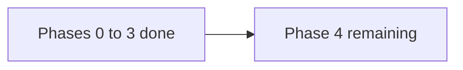
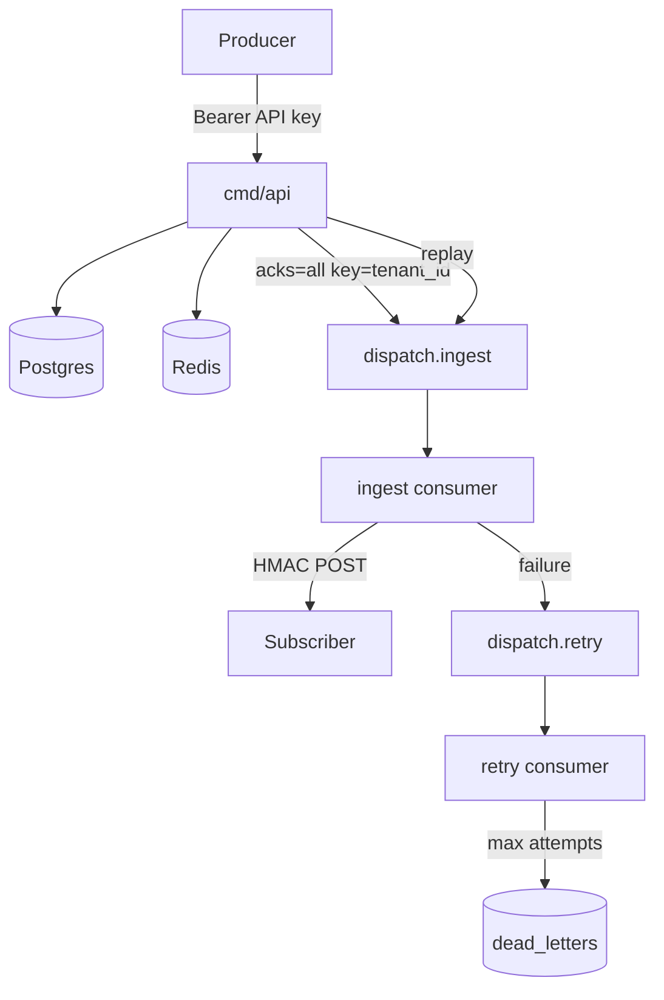

# Dispatch — Halfway Summary

**As of:** mid-build (Phases 0–3 complete; Phase 4 remaining)  
**Gates:** M0–M3 done · **M4** open  
**Related:** [project_overview.md](project_overview.md) · [architecture.md](architecture.md) · [roadmap.md](roadmap.md) · [task_list.md](task_list.md)

---

## Where we are

Dispatch is a working multi-tenant webhook platform end-to-end on Docker Compose:
ingest → Kafka → consumer fan-out → HMAC delivery → retries → DLQ replay.
AWS is expressed as validated Terraform + Helm (no live apply required for demos).



| Gate | Status | Meaning |
| ---- | ------ | ------- |
| M0 | Done | Repo skeleton + planning docs |
| M1 | Done | Core API, sync-era features (CB, rate limit, HMAC, tests) |
| M2 | Done | Kafka ingest/retry/DLQ + CI |
| M3 | Done | Terraform validated + Helm chart shaped |
| M4 | Open | Metrics, Grafana, OTel, load numbers, full README |

---

## What ships today

### Runtime (local)

- **`cmd/api`** — REST API: tenants, subscriptions, events (`202` after Kafka produce), DLQ list/replay, health probes, recovery sweep
- **`cmd/consumer`** — Ingest + retry consumer groups (`CONSUMER_MODE=all` by default)
- **Postgres** — source of truth (tenants, subscriptions, events, attempts, dead_letters, CB transitions)
- **Redis** — sliding-window rate limit + idempotency
- **Redpanda** — `dispatch.ingest` (3 partitions) + `dispatch.retry` (1 partition)

### Reliability features already in code

- HMAC-SHA256 over `timestamp.payload` + secret rotation grace
- Half-open circuit breaker (active → degraded → paused)
- Exponential backoff retries: `10s, 30s, 1m, 5m, 15m` then DLQ
- DLQ in Postgres with replay → re-produce to ingest (`409` if already replayed)
- Graceful shutdown on API and consumer; Helm `preStop` + grace period designed

### Infra artifacts

- **Terraform** (`terraform/`) — VPC, EKS + IRSA, Aurora, MSK (IAM), ElastiCache, S3 lifecycle; `terraform validate` clean
- **Helm** (`deploy/helm/dispatch/`) — api + consumer Deployments, ALB Ingress, ConfigMap/Secret, probes
- **CI** (`.github/workflows/ci.yml`) — Compose, migrate, topics, `go test -race`

### Developer loop

```bash
make up && make migrate-up
make run-api        # terminal 1
make run-consumer   # terminal 2
make test && make test-integration
```

---

## Architecture at halfway



**Ordering tradeoff (documented):** per-tenant partition ordering; failed deliveries do not block the stream.

---

## Resume keyword progress

| Keyword | Status |
| ------- | ------ |
| Go / slog / stdlib HTTP | Done |
| Postgres + golang-migrate | Done |
| Redis rate limit + idempotency | Done |
| Kafka / consumer groups / retries / DLQ | Done |
| testify + integration tests | Done |
| Terraform (VPC/EKS/Aurora/MSK/ElastiCache/S3/IAM) | Done (validate; apply optional) |
| Helm (probes, preStop, IRSA wiring) | Done |
| Grafana / Prometheus | **Phase 4** |
| OpenTelemetry / Jaeger | **Phase 4** |
| Load benchmark numbers (X K/sec, p99) | **Phase 4** |
| Full portfolio README | **Phase 4** |

---

## What’s left (Phase 4)

1. Prometheus metrics (`/metrics` on :9090) + cardinality discipline  
2. Grafana dashboard-as-code in Compose  
3. OpenTelemetry traces across API → Kafka → delivery (Jaeger locally)  
4. Load test (k6/vegeta) + completeness check + README numbers  
5. Security tests (HMAC replay window, payload size, Content-Type)  
6. Honest full README (architecture, decisions, non-goals, local run, benchmarks)

Until M4 closes, the resume line still has placeholder **X/Y** latency/throughput.

---

## Known gaps / intentional non-goals

- No OAuth — API keys only  
- No tiered retry topics — single retry topic + `retry_after` header  
- No active endpoint health pings — half-open probes with real events  
- No live AWS apply required for the portfolio demo path  
- Docs live under `docs/`; stub root `README.md` points here until Phase 4.6

---

## Suggested next move

Start Phase 4.1 (Prometheus instrumentation on api + consumer), then Grafana Compose provisioning, then OTel, then load test to fill the resume numbers.
