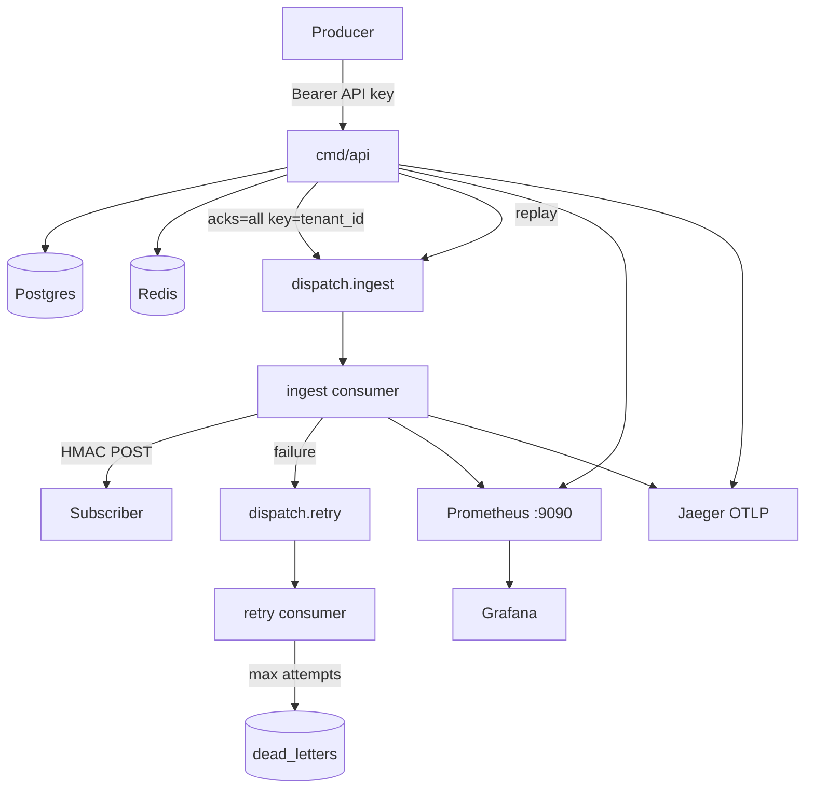

# Dispatch — Halfway summary (post-M4)

Snapshot after Phase 4 (observability & hardening). Gates **M0–M4** are closed.

---

## What’s shipped

| Area | Status |
| ---- | ------ |
| Sync core (tenants, subs, HMAC, CB, rate limit, idempotency) | Done (M1) |
| Kafka ingest / retry / DLQ + recovery sweeper | Done (M2) |
| Terraform + Helm | Done (M3) |
| Prometheus metrics + Grafana + Jaeger / OTel | Done (M4) |
| vegeta load + completeness SQL + security tests | Done (M4) |
| Portfolio README with Compose benchmark numbers | Done (M4) |



---

## Local observability

```bash
make up   # postgres redis redpanda webhook api consumer prometheus grafana jaeger
```

| UI | URL |
| -- | --- |
| API | http://localhost:8080 |
| Metrics (api) | http://localhost:9090/metrics |
| Metrics (consumer) | http://localhost:9091/metrics |
| Prometheus | http://localhost:9092 |
| Grafana | http://localhost:3000 (anon viewer / admin:admin) |
| Jaeger | http://localhost:16686 |

Load: `make load` → `scripts/load/vegeta.sh` + `scripts/load/completeness.sql`.

---

## Known gaps / intentional non-goals

- No OAuth — API keys only  
- No tiered retry topics — single retry topic + `retry_after` header  
- No active endpoint health pings — half-open probes with real events  
- No live AWS apply required for local demos  
- Absolute cloud latency numbers are not the success metric — Compose numbers in README are measured honestly on this stack

---

## Suggested next move

Optional stretch only (internal gRPC ingest, cloud apply, polish dashboards). Core portfolio path is complete through M4.
