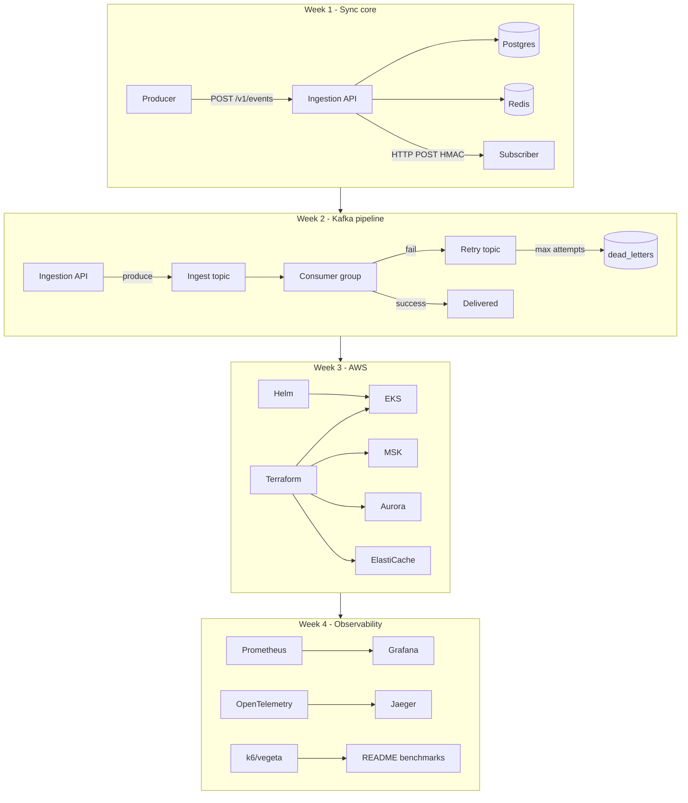

# Dispatch — Roadmap

Strategic build plan for the multi-tenant webhook delivery platform.
Design truth and deep “why” live in [`project_overview.md`](project_overview.md).
Atomic checkboxes live in [`task_list.md`](task_list.md).

---

## Vision and resume target

**Dispatch** accepts events from producers and reliably delivers them to
subscriber endpoints with retries, exponential backoff, ordering guarantees
(per-tenant best-effort), HMAC signing, circuit breaking, and full
observability. One coherent system that forces Go services, Kafka, Postgres,
Redis, AWS (EKS/MSK/Aurora/ElastiCache), Terraform, Helm, and Grafana/OTel
into a single portfolio artifact.

**Resume north-star:**

> Dispatch: Webhook Delivery Platform | Go, Kafka, AWS, Terraform, Helm, Grafana | GitHub
>
> Built a multi-tenant webhook delivery platform: Kafka consumer groups for
> event fanout, exponential-backoff retry with dead-letter replay,
> HMAC-signed payloads, per-tenant rate limiting (Redis), PostgreSQL with
> schema migrations; sustained X K events/sec at sub-Y ms p99 delivery
> latency (benchmark).
>
> Deployed on AWS EKS via Terraform (VPC, MSK, Aurora, ElastiCache, IAM)
> and Helm; Grafana dashboards over Prometheus metrics for delivery success
> rates, consumer lag, and queue depth; OpenTelemetry distributed tracing
> across the pipeline.

Keyword coverage (Kafka, AWS, Terraform, Helm, Grafana, migrations,
testify, rate limiting, circuit breaker, OTel, slog) is the burn-down
target tracked in `task_list.md` Appendix C. Fill X/Y from the Week 4
load test.

---

## Architecture evolution

**Constraint:** every week ends with a demoable system. Week 1 ships
synchronous delivery so Kafka/AWS never block a working path.

| Week | Delivery path | Infra |
| ---- | ------------- | ----- |
| 1 | Sync HTTP from API | Docker Compose (Postgres, Redis, Redpanda ready but unused for delivery) |
| 2 | Kafka ingest → consumer → retry → DLQ | Same Compose; CI on GitHub Actions |
| 3 | Same pipeline on AWS | Terraform + Helm on EKS |
| 4 | Instrumented + load-tested | Prometheus, Grafana, Jaeger, benchmark numbers |

---

## Phase milestones

### Phase 0 — Repo bootstrap (before Day 1)

**Goal:** empty workspace becomes a clonable Go monorepo shell.

**Exit criteria:** git repo, `.gitignore`, directory skeleton, stub README
linking overview / roadmap / task list. No running services required.

**Depends on:** nothing.

**Risks:** none material — keep this short so Week 1 morning starts on compose.

---

### Phase 1 — Core service (Week 1)

**Goal:** end-to-end webhook delivery without Kafka — ingest, fan-out,
HMAC, circuit breaker, rate limit, tests.

**Exit criteria:**
- `make up && make migrate-up && make run-api` works locally
- Create tenant → subscription → `POST /v1/events` → delivery_attempt row
- Five consecutive failures move subscription to `degraded`; half-open probe recovers or extends cooldown
- Rate limit returns `429` + `Retry-After`
- Unit + integration tests pass against Compose

**Major deliverables:**
- Docker Compose (Postgres 16, Redis 7, Redpanda) + Makefile + golang-migrate
- Schema: tenants, subscriptions, state_transitions, events, delivery_attempts, dead_letters
- `cmd/api` with CRUD, sync delivery, CB, Redis idempotency + rate limit
- testify unit tests + Compose integration tests

**Depends on:** Phase 0.

**Primary risks:**
- Redpanda dual-listener misconfig (host vs container)
- Migrations racing before Postgres healthy
- Circuit breaker races under concurrent deliveries
- Redis down: must fail-open for rate limiting, not wedge the API

---

### Phase 2 — Kafka event pipeline (Week 2)

**Goal:** replace sync delivery with durable async path; retries, DLQ
replay, CI.

**Exit criteria:**
- `POST /v1/events` returns `202`; consumer delivers asynchronously
- Failed deliveries land on retry topic with backoff; after max attempts → `dead_letters`
- Replay API re-produces to ingest (not inline delivery); already-replayed → `409`
- GitHub Actions: compose `--wait`, migrate, `go test ./... -race -count=1`

**Major deliverables:**
- Kafka producer (`acks=all`, key = `tenant_id`) + simplified outbox / recovery sweep
- `cmd/consumer` (ingest + retry consumer groups), manual offset commit, revoke handling
- Retry backoff: 10s, 30s, 1m, 5m, 15m
- DLQ list + replay endpoints
- CI workflow

**Depends on:** Phase 1 (sync delivery logic reused by consumer).

**Primary risks:**
- Produce inside DB transaction (don’t — persist then produce)
- Auto-commit before processing
- Alarming on expected retry-topic lag
- Partition revoke mid-message during rolling deploy

---

### Phase 3 — AWS with Terraform and Helm (Week 3)

**Goal:** reproducible cloud footprint; develop still against Compose.
Terraform plans clean; Helm packages api + consumer for EKS.

**Exit criteria:**
- `terraform plan` succeeds for VPC, EKS, Aurora, MSK, ElastiCache, S3, IAM/IRSA
- Helm chart: two Deployments, probes, preStop, IRSA ServiceAccounts, values-driven config
- Docs note MSK/EKS provision times and demo vs prod instance sizes

**Major deliverables:**
- Multi-AZ VPC (public ALB subnets, private app/data), least-privilege SGs
- EKS + managed node group + IRSA
- Aurora PostgreSQL (Secrets Manager password), MSK (TLS + IAM auth), ElastiCache, S3 archival
- Helm: liveness/readiness, preStop sleep, `terminationGracePeriodSeconds` ≥ preStop + shutdown timeout

**Depends on:** Phase 2 (binaries and topics exist conceptually).

**Primary risks:**
- Slow feedback (MSK 15–25m, EKS 10–15m) — iterate Compose-first
- Single-AZ layouts that break Aurora/MSK/ElastiCache later
- Master password in Terraform state
- Missing preStop → 503s during rolling deploys
- MSK IAM auth client wiring (prefer franz-go native support)

---

### Phase 4 — Observability and hardening (Week 4)

**Goal:** operable system with metrics, dashboards, traces, load numbers,
security tests, honest README.

**Exit criteria:**
- Prometheus metrics on `:9090`; Grafana dashboard-as-code in Compose
- OTel traces span API → Kafka → consumer → delivery; searchable by `event_id`
- Load test publishes sustained throughput + p99 latency; completeness check (events ≈ attempts + DLQs)
- Security tests: HMAC replay window, payload size, Content-Type
- README covers architecture, decisions, non-goals, local run, benchmarks

**Major deliverables:**
- Named histograms/counters/gauges from overview
- Grafana + Prometheus (+ Jaeger) in Compose
- k6 or vegeta load scenario
- Full README (primary portfolio artifact after code)

**Depends on:** Phase 2 minimum; Phase 3 for cloud deploy story (local obs works without AWS).

**Primary risks:**
- High-cardinality Prometheus labels
- Hand-written Grafana JSON (prefer export-then-commit)
- Benchmarking against cloud instead of Compose (absolute numbers don’t matter; measurement does)

---

## Coarse milestone gates

Track these as project-level done signals (fine-grained work is in `task_list.md`):

- [x] **M0** — Repo skeleton + planning docs linked
- [x] **M1** — Sync delivery E2E (tenant → event → delivery_attempt + CB + rate limit + tests)
- [x] **M2** — Kafka path: ingest, retry, DLQ replay; CI green with `-race`
- [x] **M3** — `terraform plan` clean; Helm chart deploys-shaped (probes, preStop, IRSA)
- [ ] **M4** — Grafana + OTel local stack; benchmark numbers in README; security tests green

---

## Cross-cutting tracks

These apply in every phase; do not defer to Week 4.

| Track | Week 1 | Week 2 | Week 3 | Week 4 |
| ----- | ------ | ------ | ------ | ------ |
| **Correlation IDs** | Generate `event_id` at API; slog on every line | Propagate via Kafka headers; consumer logs + attempts | Same in cloud | Span attribute + Jaeger search |
| **Graceful shutdown** | API drain (15s), `ErrServerClosed`, server timeouts | Consumer: finish message, commit, revoke hooks | Helm preStop + `terminationGracePeriodSeconds` | Verify under load / rolling narrative in README |
| **Tests** | Unit (CB, HMAC, rate limit) + Compose integration | Consumer/retry/DLQ paths; CI runs all | Smoke against Compose still primary | Security + load completeness |
| **Commit hygiene** | Atomic commits, descriptive messages | Same | Terraform/Helm in reviewable chunks | README + dashboard JSON as deliberate commits |

**Don’t over-abstract early.** Concrete repos first; interfaces when a second implementation or test double appears.

---

## Out of scope / explicit non-goals

Document these in the README; do not build them in the four-week plan:

| Non-goal | Rationale |
| -------- | --------- |
| OAuth / complex auth | API keys only — spend time on infra and operability |
| Tiered retry topics | Single retry topic + `retry_after` header is enough at this scale |
| Active endpoint health pings | Half-open probes with real signed events only |
| DLQ as a Kafka topic | Replay needs filter/pagination/`replayed_at` → Postgres |
| Strict per-subscription ordering under failure | Failed events don’t block the stream (Stripe/GitHub tradeoff) |
| Hand-rolled VPC/EKS modules | Use `terraform-aws-modules` |
| Perfect cloud absolute latency numbers | Measure on Compose; discuss bottlenecks |

**Optional stretch (resume gap only):** internal gRPC ingestion service — not required for M4.

---

## Suggested four-week calendar

Day anchors from the overview. Adjust if a gate slips; keep the always-demoable rule.

### Week 1 — Core

| Day | Focus | Task list anchors |
| --- | ----- | ----------------- |
| 1 morning | Compose, healthchecks, Makefile, migrate service | P1.1 |
| 1 afternoon | Initial schema + migrations | P1.2 |
| 1 | Go layout, slog, graceful shutdown | P1.3 |
| 2–3 | Tenant/subscription CRUD + auth | P1.4 |
| 3–4 | Sync delivery + HMAC + idempotency | P1.5 |
| 4 | Circuit breaker state machine | P1.6 |
| 5 | Rate limiting | P1.7 |
| Throughout | Unit + integration tests | P1.8 |

### Week 2 — Kafka

| Day | Focus | Task list anchors |
| --- | ----- | ----------------- |
| 1 | Producer, outbox-style produce, partition by tenant | P2.1 |
| 1–3 | Consumer group, revoke, manual commit | P2.2 |
| 3–4 | Retry topic + backoff + DLQ write | P2.3 |
| 4 | DLQ list + replay API | P2.4 |
| 5 | GitHub Actions CI | P2.5 |

### Week 3 — AWS

| Day | Focus | Task list anchors |
| --- | ----- | ----------------- |
| 1 | VPC + networking | P3.1 |
| 1–2 | EKS + IRSA | P3.2 |
| 2 | Aurora | P3.3 |
| 2–3 | MSK | P3.4 |
| 3 | ElastiCache + S3 | P3.5 |
| 4–5 | Helm chart | P3.6 |

### Week 4 — Observability

| Day | Focus | Task list anchors |
| --- | ----- | ----------------- |
| 1–2 | Prometheus metrics | P4.1 |
| 2–3 | Grafana dashboard + Compose provisioning | P4.2 |
| 3–4 | OpenTelemetry + Jaeger | P4.3 |
| 4–5 | Load test + completeness | P4.4 |
| 5 | Security hardening tests | P4.5 |
| 5 | README | P4.6 |

---

## Doc map

| Doc | Role |
| --- | ---- |
| [`project_overview.md`](project_overview.md) | Architecture, design decisions, watch-outs |
| [`roadmap.md`](roadmap.md) | Phases, gates, calendar, non-goals |
| [`task_list.md`](task_list.md) | Atomic checkboxes + acceptance criteria |
