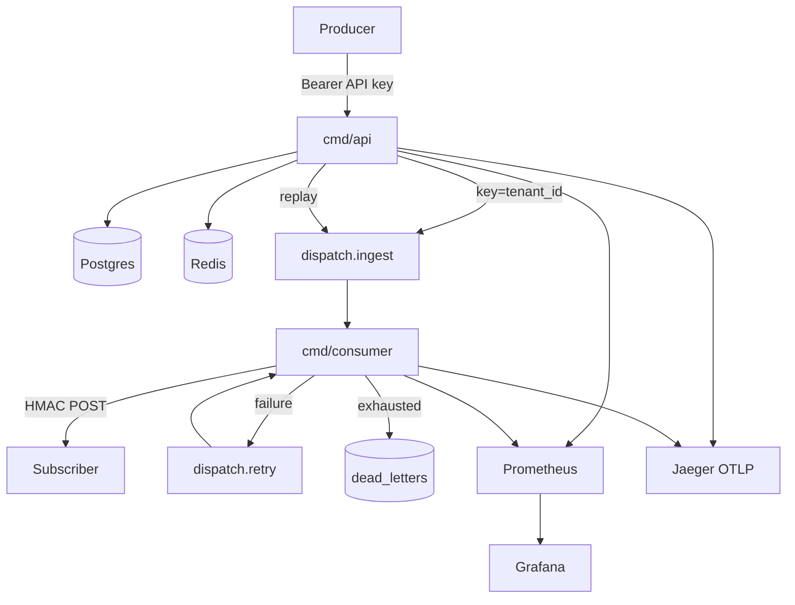

# Dispatch — Project summary

End-to-end picture of the multi-tenant webhook delivery platform: what it is,
how it works, what shipped, how to run it, and what it deliberately does not do.

Deep dives: [`architecture.md`](architecture.md) · [`project_overview.md`](project_overview.md) ·
[`roadmap.md`](roadmap.md) · [`task_list.md`](task_list.md) · root [`README.md`](../README.md)

**Repo:** https://github.com/yxshwanth/Dispatch  
**Module:** `github.com/yash/dispatch`  
**Status:** Phases 0–4 complete · gates **M0–M4** closed · Definition of Done met  
Half-open probe is single-flight via `store.ClaimProbe`. Optional stretch: unary gRPC ingest on `:9000` sharing `internal/ingest.Service` with REST.

---

## 1. What it is

**Dispatch** accepts events from producers over HTTP and reliably delivers them
to tenant webhook endpoints with:

- Multi-tenant API-key auth
- HMAC-SHA256 signed delivery (Stripe/GitHub-style `timestamp.payload`)
- Exponential backoff retries, then Postgres dead-letter queue with replay
- Circuit breaker (`active → degraded → paused`) with a **single** half-open probe
  (real event; concurrent waiters skip until that probe finishes)
- Per-tenant rate limiting and optional idempotency keys
- Kafka-backed async pipeline (Redpanda locally, MSK-shaped in Terraform)
- Prometheus metrics, Grafana dashboards, OpenTelemetry → Jaeger traces

Producers care about **accepting** events quickly (`202`). Subscribers care about
**signed, retryable** delivery without one bad endpoint stalling a whole tenant.

---

## 2. System overview



| Binary | Role |
| ------ | ---- |
| `cmd/api` | REST API, persist events, produce to Kafka, DLQ replay, recovery sweeper, metrics + traces |
| `cmd/consumer` | Ingest + retry consumer groups, HMAC delivery, retries / DLQ, lag gauges |

**Local stack:** Go · Postgres 16 · Redis 7 · Redpanda · Prometheus · Grafana · Jaeger  
**Cloud shape:** Terraform (VPC, EKS+IRSA, Aurora, MSK, ElastiCache, S3) · Helm chart for api + consumer

---

## 3. Delivery pipeline

1. **Ingest** — `POST /v1/events` authenticates, rate-limits, validates JSON / size / Content-Type, persists the event, produces to `dispatch.ingest` (partition key = `tenant_id`), returns `202`.
2. **Consume** — ingest group loads matching subscriptions by `event_type`, attempts HMAC delivery.
3. **Success** — write `delivery_attempts`, reset CB failures as appropriate.
4. **Failure** — enqueue `dispatch.retry` with backoff schedule `10s → 30s → 1m → 5m → 15m`.
5. **Exhausted** — insert `dead_letters`; optional `POST /v1/dead-letters/{id}/replay` re-produces to ingest.
6. **Recovery** — API sweeper re-produces events that never got attempts (crash / produce gap).

**Ordering:** per-tenant on the ingest topic. Failed deliveries do **not** block later events for the same subscription (best-effort under failure).

---

## 4. Core domain features

| Feature | Behavior |
| ------- | -------- |
| Tenants | `POST /v1/tenants` returns plaintext API key once; stored as SHA-256 hash |
| Subscriptions | URL + `event_types[]`; HMAC secret returned once; dual-secret rotation with grace window |
| HMAC | `X-Dispatch-Signature` = hex HMAC-SHA256 over `{unix}.{body}`; receivers should reject timestamps outside a **5-minute** window (`hmacsign.VerifyFresh`) |
| Circuit breaker | Threshold failures → `degraded`; after cooldown **one** real event is claimed as half-open probe (`ClaimProbe`); DLQ flood → `paused` |
| Rate limit | Redis sliding window per tenant |
| Idempotency | Optional `Idempotency-Key` → Redis `SET NX` + TTL; replay returns prior event |
| Security HTTP | Oversized body → `413`; non-JSON Content-Type → `415` |

---

## 5. Observability

| Signal | Detail |
| ------ | ------ |
| Metrics | Dedicated server `METRICS_ADDR` (default `:9090`) on api and consumer |
| Key series | `dispatch_delivery_duration_seconds`, `dispatch_delivery_total`, `dispatch_events_ingested_total` (no tenant label), `dispatch_dead_letters_total`, `dispatch_circuit_breaker_state{state=…}`, `dispatch_consumer_lag`, `dispatch_retry_queue_depth` |
| Grafana | Provisioned dashboard **Dispatch Delivery** under `deploy/observability/grafana/` |
| Tracing | `internal/tracing` OTLP/HTTP → Jaeger; spans on ingest, Kafka produce/consume, delivery; `event_id` attribute; W3C context on Kafka headers |
| Skipped paths | `/healthz`, `/readyz`, `/metrics` |

---

## 6. Build phases and gates

| Gate | Phase | Outcome |
| ---- | ----- | ------- |
| **M0** | Repo bootstrap | Git, layout, stub README, planning docs |
| **M1** | Sync core | Tenants/subs/events, HMAC, CB, rate limit, idempotency, tests |
| **M2** | Kafka path | Ingest/retry/DLQ, consumer, recovery, CI with `-race` |
| **M3** | Cloud shape | Terraform validated; Helm (probes, preStop, IRSA-ready) |
| **M4** | Observability & hardening | Metrics, Grafana, Jaeger/OTel, vegeta + completeness, security tests, full README |

Optional stretch (not required): internal gRPC ingestion service.

Atomic checkboxes: [`task_list.md`](task_list.md). Calendar narrative: [`roadmap.md`](roadmap.md).

---

## 7. Local run

```bash
make up              # full stack: data plane + api + consumer + webhook + obs
make run-api         # host iterate against Compose infra
make run-consumer
make test
make test-integration
make load            # vegeta + completeness SQL
make down
```

| Service | URL |
| ------- | --- |
| API | http://localhost:8080 |
| Metrics (api / consumer) | http://localhost:9090 / `:9091` |
| Prometheus | http://localhost:9092 |
| Grafana | http://localhost:3000 (admin/admin; anonymous viewer on) |
| Jaeger | http://localhost:16686 |
| Webhook echo | http://localhost:8081 |

Compose webhook URL for in-network consumers: `http://webhook:8080/`.

---

## 8. Benchmarks (Compose)

Two different latencies — do not conflate them. Numbers below are from the
**2026-07-16** Compose run (`RATE=50/s`, ~15s, vegeta → Compose `webhook`),
with fine delivery histogram buckets.

**Ingest** (vegeta → `POST /v1/events` → `202`):

| Metric | Result |
| ------ | ------ |
| Rate | **50.1 events/sec**, **750** requests, **100%** `202` |
| HTTP latency | p50 **1.30 ms** · p95 **1.75 ms** · p99 **2.09 ms** · max **17.1 ms** |

**Delivery** (consumer → subscriber), `dispatch_delivery_duration_seconds{status="success"}`
(n=750 after that load):

| Metric | Result |
| ------ | ------ |
| Mean (`_sum/_count`) | **1.62 ms** |
| p50 / p95 / p99 | **~1.7 / ~2.4 / ~2.5 ms** (bucket-interpolated) |
| Mass | **99.7%** ≤ **2.5 ms** |
| Consumer lag | **0** |

Completeness: no silent loss for matched subscriptions after settle
(`scripts/load/completeness.sql`). Dashboard:
http://localhost:3000/d/dispatch-delivery/dispatch-delivery

---

## 9. Deploy artifacts

| Path | Contents |
| ---- | -------- |
| [`terraform/`](../terraform/) | VPC, EKS+IRSA, Aurora, MSK, ElastiCache, S3 |
| [`deploy/helm/dispatch/`](../deploy/helm/dispatch/) | api + consumer Deployments, probes, preStop, scrape annotations, Ingress-shaped values |
| [`deploy/observability/`](../deploy/observability/) | Prometheus scrape config + Grafana datasource/dashboard provisioning |
| [`migrations/`](../migrations/) | Schema (tenants, subscriptions, events, attempts, dead_letters, CB audit) |
| [`.github/workflows/ci.yml`](../.github/workflows/ci.yml) | Compose, migrate, topics, `go test ./... -race` |

Local demos do not require a live AWS apply.

---

## 10. Design decisions (short)

| Decision | Choice | Why |
| -------- | ------ | --- |
| Failure ordering | Don’t block the stream | One dead URL must not stall a tenant |
| Half-open CB | Real signed events | Synthetic GETs/POSTs are useless or rude on webhooks |
| DLQ store | Postgres | Query, paginate, mark replayed |
| Retries | One retry topic + `retry_after` | Simpler than delay-topic tiers |
| Metrics labels | No high-cardinality `tenant_id` on ingest | Protect Prometheus |
| Kafka client | franz-go | Groups + future MSK IAM |

Rationale essay: [`project_overview.md`](project_overview.md).

---

## 11. Non-goals

- OAuth / complex identity (API keys only)
- Tiered Kafka delay topics
- Active endpoint health pings
- Strict per-subscription ordering when a delivery fails
- Treating absolute cloud latency as the success metric

---

## 12. Package map (high level)

```
cmd/api, cmd/consumer
internal/
  httpapi/         REST + auth middleware
  kafka/           produce, consume, lag, W3C header carrier
  delivery/        HMAC outbound POST + metrics/spans
  circuitbreaker/  pure state machine
  store/           Postgres access
  ratelimit/, idempotency/, auth/, hmacsign/
  recovery/        orphan event re-produce
  metrics/, tracing/, config/
```

---

## 13. Doc index

| Doc | Use when you need… |
| --- | ------------------ |
| [`summary.md`](summary.md) | This page — whole-project snapshot |
| [`architecture.md`](architecture.md) | Pipelines, packages, CB/DLQ/HMAC detail |
| [`project_overview.md`](project_overview.md) | Design “why” and original phased plan |
| [`roadmap.md`](roadmap.md) | Gates, weeks, risks |
| [`task_list.md`](task_list.md) | Atomic done checkboxes |
| [`../README.md`](../README.md) | Quick start, API table, published benchmarks |
